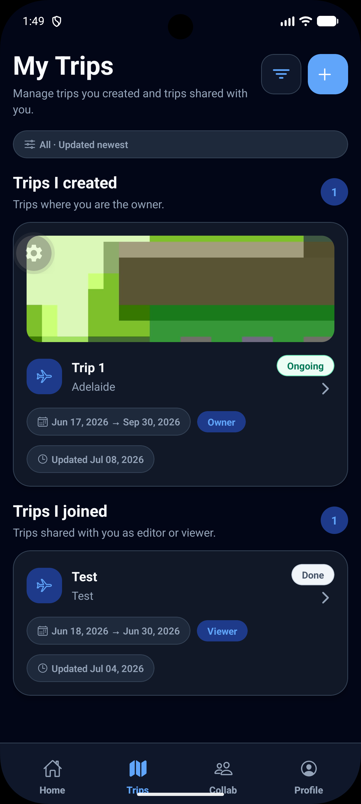
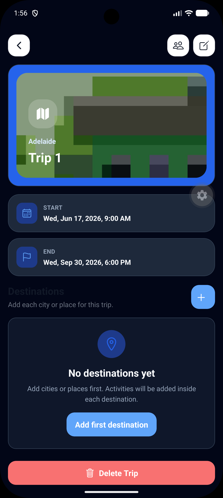
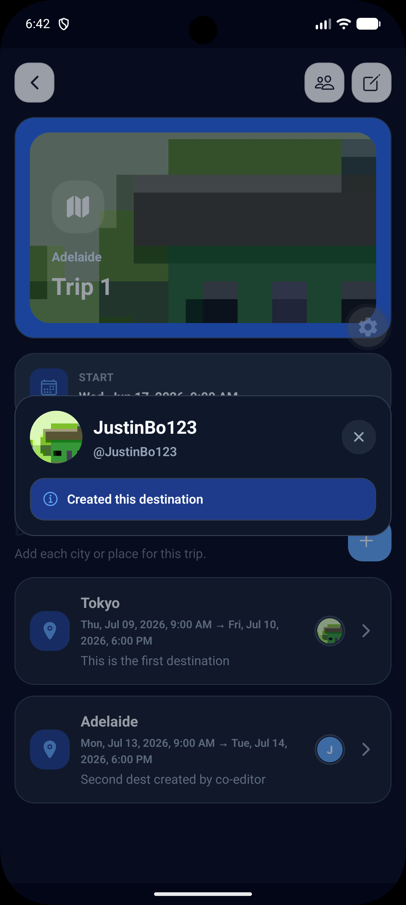
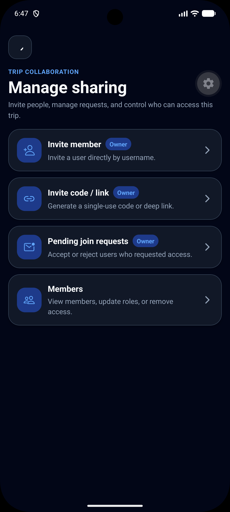
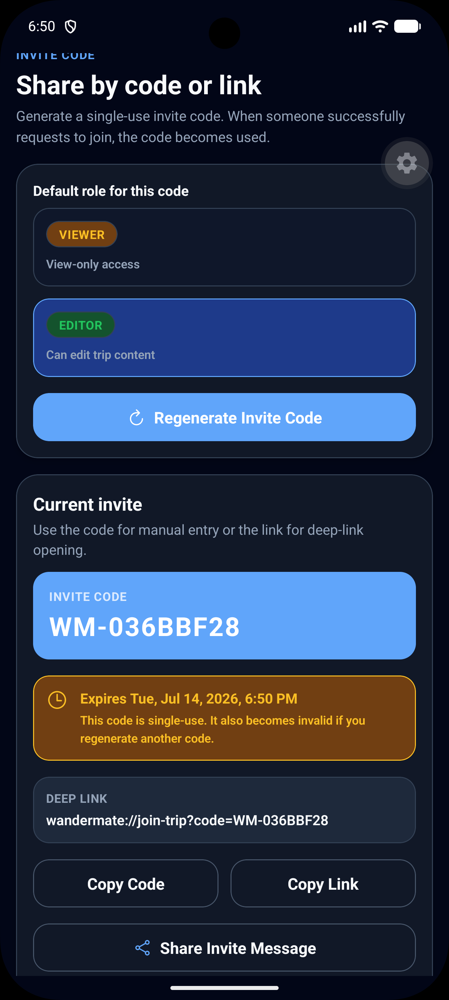
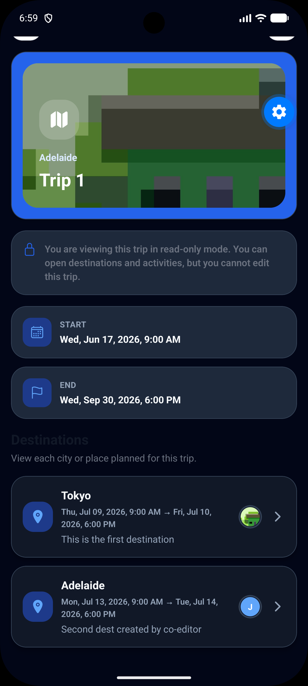
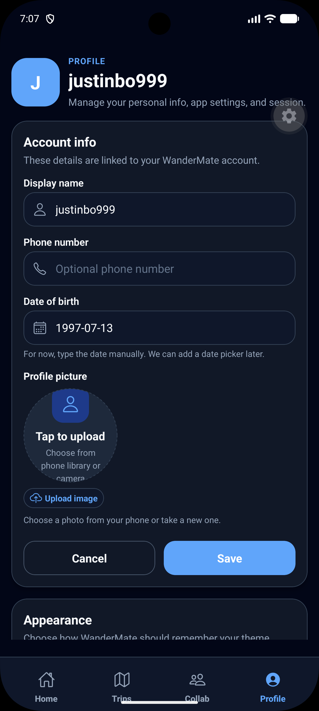
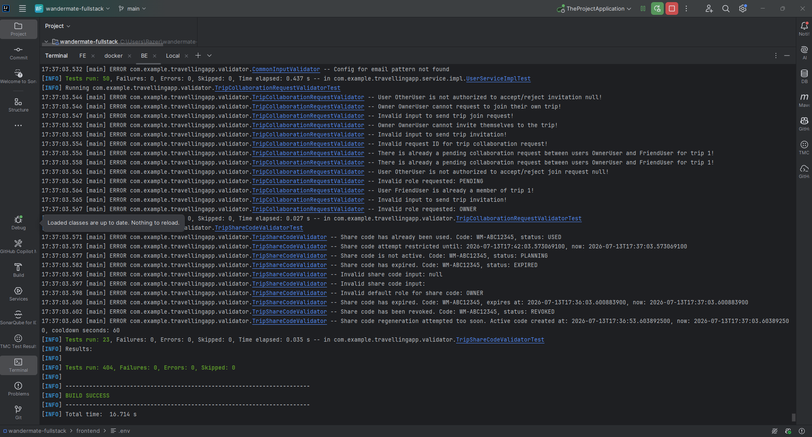
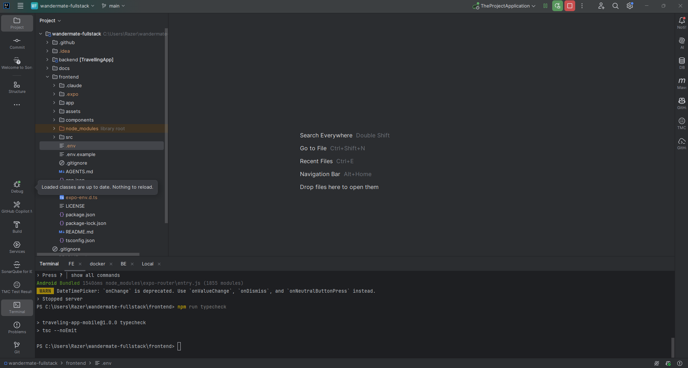
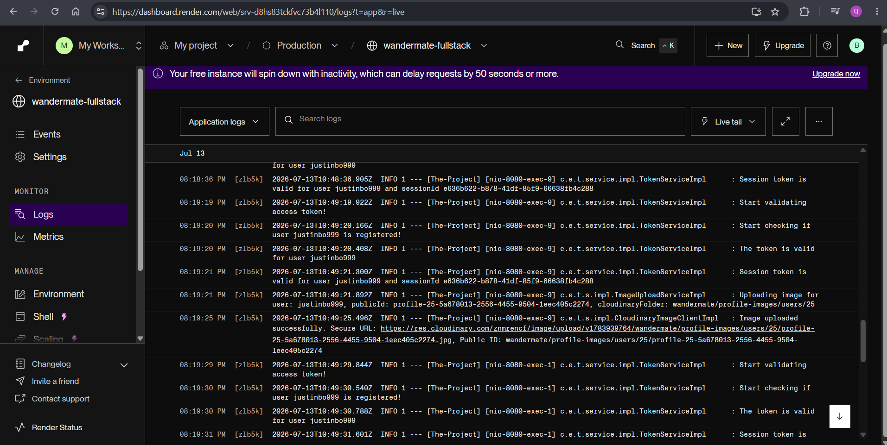

# WanderMate — Full-Stack Trip Planning and Collaboration App

WanderMate is a full-stack mobile trip planning app built with **Spring Boot**, **MariaDB**, **React Native Expo**, and **Cloudinary**. It helps users create trips, organise destinations and activities, upload profile/trip images, and collaborate with other users through **OWNER**, **EDITOR**, and **VIEWER** roles.

This project is designed as a realistic junior/graduate backend/full-stack portfolio project. It includes secure authentication, OTP verification, JWT access tokens, refresh tokens, session tokens, logout/session revocation, role-based access control, nested trip content, image upload, Docker support, production deployment proof, backend tests, and mobile frontend integration.

## Current V4 status

| Area | Status |
|---|---|
| Backend API | Feature-complete for V4 |
| Frontend mobile app | Feature-complete for V4 |
| Authentication | Email/password, OTP, access token, refresh token, session token, logout/session revocation |
| Trip planning | Trips, destinations, nested activities, date validation, role-aware access |
| Collaboration | Owner/editor/viewer roles, invitations, join requests, share codes, collaboration summary |
| Image upload | Cloudinary upload for profile avatars and trip cover images |
| Testing | 438 backend test methods plus 10 frontend unit/component tests |
| Docs | Root, backend, frontend and backend docs updated with screenshot proof |
| Portfolio readiness | Final security, evidence and submission verification in progress |

## Tech stack

### Backend

- Java 21
- Spring Boot 3
- Spring Security
- Spring Data JPA / Hibernate
- MariaDB
- JWT with access and refresh tokens
- Session token tracking and revocation
- OTP verification
- Transaction-safe OTP/share-code failure accounting
- Cloudinary image storage
- Docker / Docker Compose
- JUnit 5 and Mockito
- Swagger / OpenAPI

### Frontend

- React Native with Expo Router
- TypeScript
- Axios
- Expo SecureStore
- Expo Image Picker
- Expo Clipboard
- Zustand-style auth/theme stores
- Screen-level TypeScript validation flow
- Persistent bottom tabs
- Light/dark theme support

## Screenshots

The full screenshot set is stored in:

```text
docs/screenshots/
```

### Main app flow

| My Trips | Trip Detail |
|---|---|
|  |  |

| Creator Attribution | Collaboration Menu |
|---|---|
|  |  |

| Share Code | Member Roles |
|---|---|
|  |  |

| Viewer Read-only | Profile Settings |
|---|---|
|  |  |

## Available screenshot inventory

| File | What it proves | Notes |
|---|---|---|
| `01-login.png` | Login screen | Auth entry point in light mode. |
| `02-register-otp.png` | Register / OTP verification | Registration OTP flow with resend timer. |
| `03-my-trips.png` | My Trips | Trip list with cover image and trip cards. |
| `04-trip-detail-owner.png` | Trip detail as owner | Owner view with trip cover, dates, destinations and actions. |
| `05-trip-cover-upload.png` | Trip cover upload | Trip edit screen with Cloudinary cover upload. |
| `06-destinations-with-creator.png` | Destinations with creator attribution | Destination list showing profile/creator attribution. |
| `07-destination-detail.png` | Destination detail | Destination details, creator, role-aware actions. |
| `08-activity-detail.png` | Activity detail | Nested activity details inside a destination. |
| `09-collaboration-menu-owner.png` | Collaboration menu | Owner collaboration entry points. |
| `10-invite-member.png` | Invite member | Invite by username with role selection. |
| `11-share-code.png` | Share code | Generated trip share code/link. |
| `12-join-requests.png` | Join requests | Owner review of pending join requests. |
| `13-members-role-management.png` | Member role management | Members list with OWNER/EDITOR/VIEWER roles. |
| `14-viewer-read-only.png` | Viewer read-only | Viewer role showing read-only permission state. |
| `15-profile-avatar-settings.png` | Profile/avatar/settings | Profile screen with avatar upload and theme settings. |
| `18-swagger-local.png` | Swagger/OpenAPI local | Local API docs page. |
| `19-backend-tests.png` | Backend tests | Maven/Surefire test pass proof. |
| `20-frontend-typecheck.png` | Frontend typecheck | TypeScript typecheck pass proof. |
| `21-github-repo.png` | GitHub repo | Repository/commit history proof. |
| `22-cloudinary-upload-proof.png` | Cloudinary upload proof | Cloudinary media library proof. |
| `23-docker-running.png` | Docker running | Docker Desktop / containers proof. |
| `24-api-postman-proof.png` | Postman protected API proof | Must be replaced: the old image exposed raw tokens and was removed. |
| `25-render-logs.png` | Render logs | Production startup/deploy log proof. |
| `26-database-schema.png` | Database schema | MariaDB/DBeaver table schema proof. |
| `27-mobile-upload-proof.png` | Mobile upload proof | Emulator/device upload proof. |
| `28-owner-editor-viewer-proof.png` | Role differences proof | Owner/editor/viewer behaviour comparison. |
| `29-session-limit-proof.png` | Session limit proof | Maximum session warning proof. |
| `30-logout-session-proof.png` | Logout/session revocation proof | Logout/session revocation behaviour proof. |

## Main features

### Authentication and account security

- User registration with OTP verification.
- Forgot-password flow with OTP verification.
- Password hashing on the backend.
- JWT access token for protected API calls.
- Refresh token for issuing new access tokens.
- Session token for active-session tracking.
- Logout/session revocation.
- Maximum active session handling.
- Refresh-token reuse detection with independently committed revocation.
- Generic invalid-credential/recovery responses to reduce account enumeration.
- Protected API routes through Spring Security filter logic.

### Trip planning

- Create, view, update and delete trips.
- Trip status handling based on start/end dates.
- Destination CRUD under each trip.
- Nested activity CRUD under each destination.
- Date/time validation and overlap warnings.
- Search and suggestion endpoints for cities, restaurants and accommodations.

### Collaboration

- Trip owner/editor/viewer roles.
- Owner can invite users by username.
- Owner can generate and manage share codes.
- Users can join trips using share codes.
- Owner can accept/reject join requests.
- Owner can update member roles or remove members.
- Viewer role is read-only.
- Frontend hides actions based on permissions.
- Collaboration summary badges show pending work.

### Image upload

- Profile avatar upload to Cloudinary.
- Trip cover image upload to Cloudinary.
- Image URL and public ID are stored so old Cloudinary assets can be cleaned up when changed.
- Newly assigned image references must match the authenticated uploader's server-generated Cloudinary folder and public ID pattern.
- Frontend image picker integrates with backend multipart upload.
- Backend checks size, declared MIME, file signatures, and decodes PNG/JPEG content before upload.

## Backend API groups

| Group | Purpose |
|---|---|
| `/api/v1/health` | Health check |
| `/api/v1/users` | register, login, logout, profile, settings |
| `/api/v1/otp` | send and verify OTP |
| `/api/v1/auth` | refresh access token |
| `/api/v1/uploads` | image upload |
| `/api/v1/trips` | trip CRUD, search, suggestions, collaboration actions |
| `/api/v1/trips/{tripId}/destinations` | destination CRUD |
| `/api/v1/trips/{tripId}/destinations/{destinationId}/activities` | nested activity CRUD |
| `/api/v1/trips/{tripId}/members` | member role management |
| `/api/v1/collaboration` | collaboration dashboard summary |

## Local setup

### Backend

```bash
cd backend
./mvnw spring-boot:run
```

The backend context path is:

```text
/Wandermate
```

Local base URL example:

```text
http://localhost:8080/Wandermate
```

### Frontend

```bash
cd frontend
npm install
npm run start
```

For a real phone when LAN mode has asset-loading issues, use:

```bash
npx expo start --tunnel -c
```

## Testing proof

The backend suite currently defines:

```text
438 JUnit test methods
```

Screenshot proof:



Frontend TypeScript proof:



## Production proof

Live Render health check (the free service may take about a minute to wake):

[Open the production health endpoint](https://wandermate-fullstack.onrender.com/Wandermate/api/v1/health)

Render logs proof:



## Important security note

Do **not** commit or share real `.env` files, access tokens, refresh tokens, session tokens, email OAuth refresh tokens, Cloudinary secrets, database credentials, or raw production database dumps.

Safe public sharing should include code, sanitized docs, sanitized Postman environments, and sanitized seed data only.

## Documentation

- [Backend README](backend/README.md)
- [Frontend README](frontend/README.md)
- [Backend docs index](backend/docs/README.md)
