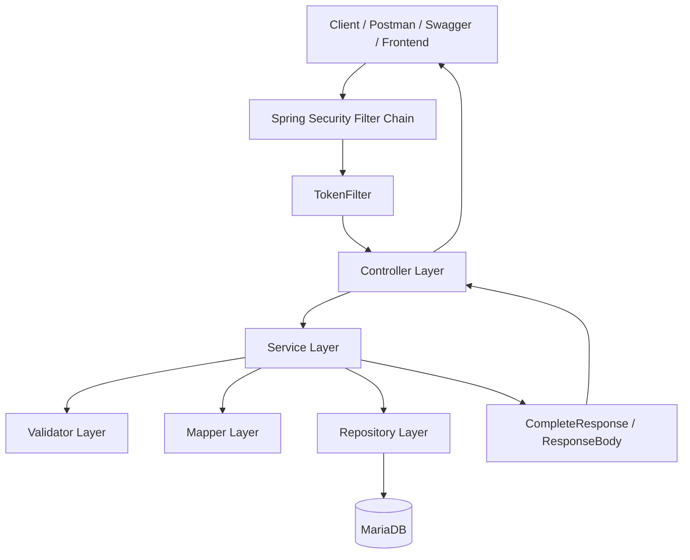
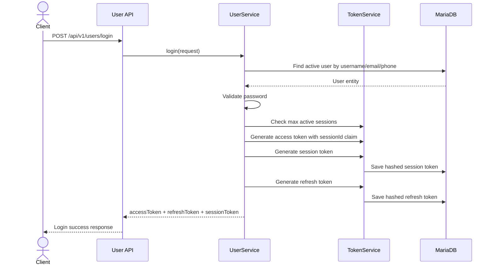

# Travelling App Backend

A Spring Boot backend for a travel planning application. The backend provides user authentication, token/session management, OTP verification, trip management, activity management, Swagger API documentation, and Docker-based local setup.

This project is designed as a backend portfolio project with real-world backend concerns such as JWT authentication, refresh token handling, database-backed configuration, request validation, ownership checks, safe environment variable usage, and Dockerized demo setup.

---

## Tech Stack

| Area | Technology |
|---|---|
| Language | Java 21 |
| Framework | Spring Boot |
| Database | MariaDB |
| ORM | Spring Data JPA / Hibernate |
| Security | Spring Security, JWT, refresh tokens, session tokens |
| API Documentation | Swagger / SpringDoc OpenAPI |
| Build Tool | Maven |
| Containerization | Docker, Docker Compose |
| API Testing | Postman |

---

## Main Features

- User registration and login
- JWT access token authentication
- Refresh token generation, validation, rotation, reuse detection, and revocation
- Session token handling for active login sessions
- Logout flow with session and refresh token revocation
- OTP sending and verification flow
- Email sending using Gmail OAuth configuration
- Trip CRUD
- Activity CRUD
- Activity time-overlap validation
- User ownership checks for protected resources
- DTO validation and global exception handling
- Swagger UI with JWT Bearer authorization
- Postman collection support
- Dockerized backend and MariaDB demo environment
- Safe `.env.example` and cleaned database seed for GitHub

---

## Backend Architecture



The project follows a layered backend structure:

```text
Controller → Service → Validator / Mapper → Repository → Database
```

The service layer coordinates business logic, validators handle input/business validation, mappers convert entities to response DTOs, and repositories handle database access.

More details are available in [`docs/ARCHITECTURE.md`](docs/ARCHITECTURE.md).

---

## Authentication Overview

Login returns three important values:

```text
accessToken
refreshToken
sessionToken
```

Protected requests require:

```text
Authorization: Bearer <accessToken>
Session-Token: <sessionToken>
```



More details are available in [`docs/AUTH_FLOW.md`](docs/AUTH_FLOW.md).

---

## Docker Local Demo Setup

The project includes Docker setup for running the backend and a local MariaDB database without manually installing Java, Maven, or MariaDB.

### 1. Create `.env`

Copy the example file:

```bash
cp .env.example .env
```

On Windows, copy `.env.example` manually and rename it to `.env`.

### 2. Run with Docker

```bash
docker compose up --build
```

### 3. Open Swagger

If the backend is mapped to port `8081`:

```text
http://localhost:8081/The-Project/swagger-ui/index.html
```

More details are available in [`docs/DOCKER_SETUP.md`](docs/DOCKER_SETUP.md).

---

## Environment Variables

Sensitive values are not committed to GitHub. The real `.env` file is ignored by Git.

Safe example values are provided in `.env.example`:

```env
DB_USERNAME=traveling_user
DB_PASSWORD=traveling_password
DB_ROOT_PASSWORD=root_password

SPRING_DATASOURCE_URL=jdbc:mariadb://db:3306/traveling_app
SPRING_DATASOURCE_USERNAME=traveling_user
SPRING_DATASOURCE_PASSWORD=traveling_password
SPRING_JPA_HIBERNATE_DDL_AUTO=update

EMAIL_OAUTH_REFRESH_ENABLED=false
EMAIL_CLIENT_ID=replace_me
EMAIL_CLIENT_SECRET=replace_me
EMAIL_REFRESH_TOKEN=replace_me
EMAIL_TOKEN_URL=https://oauth2.googleapis.com/token
EMAIL_ADDRESS_CONFIG=demo@example.com
```

For private local testing or deployment, real values should be provided through `.env` or cloud provider environment variables.

---

## Database Seed

The Docker demo database uses a cleaned seed file:

```text
docker/init/init.sql
```

This file contains safe configuration/error-code seed data for local demo. It should not contain real secrets, real users, OTP records, refresh tokens, session tokens, or OAuth credentials.

More details are available in [`docs/DATABASE_SEED.md`](docs/DATABASE_SEED.md).

---

## Main API Areas

| Module | Purpose |
|---|---|
| Users | Register, login, check user details, forgot password, logout |
| Auth / Token | Refresh access token, validate/revoke token/session state |
| OTP | Send and verify OTP |
| Trips | Create, read, update, delete trips |
| Activities | Create, read, update, delete activities within trips |
| Swagger | API documentation and manual testing |

More details are available in [`docs/API_GUIDE.md`](docs/API_GUIDE.md).

---

## Postman Testing

Postman can be used to test the main backend flows:

- Register
- Login
- Refresh token
- Logout
- OTP send/verify
- Trip CRUD
- Activity CRUD

More details are available in [`docs/POSTMAN_GUIDE.md`](docs/POSTMAN_GUIDE.md).

---

## Security Notes

- `.env` is ignored and should never be committed.
- `.env.example` contains placeholders only.
- The public `init.sql` is cleaned for demo use.
- Real OAuth credentials should be stored in private environment variables or cloud secrets.
- Refresh tokens and session tokens are stored as hashes.
- Protected APIs require an access token and session token.
- Resource access is protected through ownership-based repository queries.

---

## Current Project Status

```text
✅ Core backend implemented
✅ Auth, session, and refresh token flow implemented
✅ Trip and activity APIs implemented
✅ Docker setup completed
✅ Swagger/Postman supported
✅ Safe public seed file prepared
```

Next improvements:

```text
1. Add frontend integration
2. Add automated tests for key flows
3. Add deployment guide
4. Add screenshots and demo video
5. Improve README with final frontend screenshots
```

---

## Documentation

- [`docs/ARCHITECTURE.md`](docs/ARCHITECTURE.md)
- [`docs/AUTH_FLOW.md`](docs/AUTH_FLOW.md)
- [`docs/API_GUIDE.md`](docs/API_GUIDE.md)
- [`docs/DOCKER_SETUP.md`](docs/DOCKER_SETUP.md)
- [`docs/DATABASE_SEED.md`](docs/DATABASE_SEED.md)
- [`docs/POSTMAN_GUIDE.md`](docs/POSTMAN_GUIDE.md)
