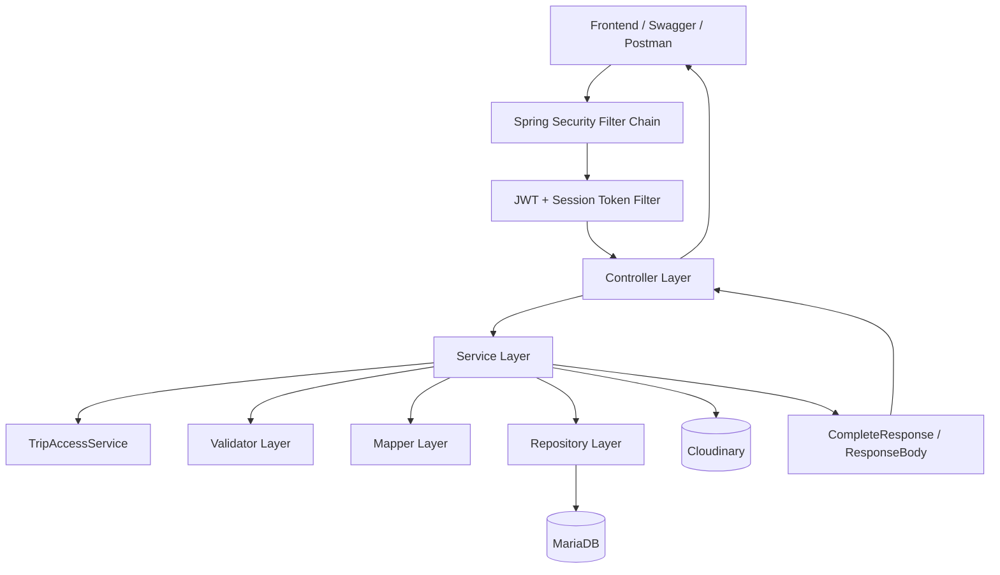

# WanderMate Backend

Spring Boot backend for the WanderMate travel planning application. It provides secure authentication, token/session handling, OTP flows, trip/destination/activity planning, role-based collaboration, Cloudinary image upload, MariaDB persistence, Docker setup, tests, CI/CD, and Render deployment configuration.

The backend is written as a portfolio-grade API project. It demonstrates production-style backend concerns: authentication, token lifecycle management, business validation, access control, relational modelling, media storage integration, testable service design, deployment profiles, and safe documentation.

---

## Tech Stack

| Area | Technology |
|---|---|
| Language | Java 21 |
| Framework | Spring Boot 3.5.x |
| Database | MariaDB |
| ORM | Spring Data JPA / Hibernate |
| Security | Spring Security, JWT, refresh tokens, session tokens |
| OTP / Email | Spring Mail, OAuth/email configuration |
| Media storage | Cloudinary |
| API docs | SpringDoc OpenAPI / Swagger for local development |
| Build | Maven |
| Tests | JUnit 5, Mockito, MockMvc, AssertJ |
| Containerization | Docker, Docker Compose |
| Deployment | Render |
| CI/CD | GitHub Actions + Render deploy hook |

---

## Current Status

```text
✅ User registration/login/logout/forgot-password
✅ Password hashing and safe auth responses
✅ JWT access token authentication
✅ Refresh token rotation, revocation, and reuse detection
✅ Session token handling for active login sessions
✅ Max active session enforcement
✅ Email OTP implemented when email config is provided
✅ OTP expiry, retry/block handling, destination matching, and consume-on-success
✅ Trip, destination, and activity CRUD
✅ Date/time validation and overlap handling
✅ Role-based collaboration: OWNER, EDITOR, VIEWER
✅ Invitation and join-request collaboration flows
✅ Share-code join flow
✅ Private member overlap warnings
✅ Destination/activity createdBy and modifiedBy attribution
✅ Profile settings with display name, theme, and profile image
✅ Trip cover image support
✅ Cloudinary upload with secure URL + publicId storage
✅ Old Cloudinary asset cleanup when images are replaced/removed
✅ Standardized response wrapper and error code system
✅ Swagger UI available locally
✅ Swagger/OpenAPI disabled in production profile
✅ Docker Compose local backend + MariaDB setup
✅ Render production profile and health endpoint
```

Not enabled yet:

```text
⚠️ Real SMS provider integration
⚠️ Viewer suggestion workflow
⚠️ Cost sharing/budget split
```

---

## Architecture Summary



Layering:

```text
Controller → Service → Access Control / Validator / Mapper → Repository → Database
```

Key design choices:

```text
- Controllers stay thin
- Services orchestrate business flows
- Validators keep input/business validation separate
- TripAccessService centralizes collaboration permission checks
- Mappers prevent returning JPA entities directly
- Standard response wrappers keep frontend handling consistent
- Token/session data is stored and revocable server-side
- Cloudinary stores media; MariaDB stores only URL/publicId metadata
```

---

## Core Domain Model

```text
User
└── Trip
    ├── Trip cover image
    ├── TripMember
    │   ├── OWNER
    │   ├── EDITOR
    │   └── VIEWER
    ├── Destination
    │   └── Activity
    └── TripCollaborationRequest
        ├── INVITATION
        └── JOIN_REQUEST
```

Important entities:

```text
User
TripEntity
DestinationEntity
ActivityEntity
TripMemberEntity
TripCollaborationRequestEntity
TripShareCodeEntity
OtpCheckEntity
RefreshTokenEntity
SessionTokenStoreEntity
ConfigurationEntity
ErrorCodeEntity
```

---

## Authentication Overview

Login returns:

```text
accessToken
refreshToken
sessionToken
```

Protected requests require:

```text
Authorization: Bearer <accessToken>
Session-Token: <sessionToken>
```

Refresh requests require:

```text
Refresh-Token: <refreshToken>
Session-Token: <sessionToken>
```

Logout revokes the active session token and related refresh tokens.

Refresh tokens are hashed in the DB. Session tokens are encoded in the DB. Access tokens include username and sessionId claims.

---

## Collaboration Rules

```text
OWNER
- Created automatically when a trip is created
- Can manage members, invitations, join requests, trip content, and trip deletion

EDITOR
- Can view and modify trip, destination, and activity content
- Cannot manage members or delete the trip

VIEWER
- Can view shared trip content only
```

Collaboration flow:

```text
Owner invitation → target accepts/rejects → member added only on accept
Join request → owner accepts/rejects → member added only on accept
Private overlap warning → visible only to affected member
```

---

## Cloudinary Media Upload

The backend exposes:

```http
POST /api/v1/uploads/images
```

Protected headers:

```text
Authorization: Bearer <accessToken>
Session-Token: <sessionToken>
Content-Type: multipart/form-data
```

Form data:

```text
file = image file
imageType = profile-images | trip-covers
```

Response body:

```json
{
  "imageUrl": "https://res.cloudinary.com/.../image/upload/...jpg",
  "publicId": "wandermate/profile-images/users/1/profile-1-abc",
  "fileName": "wandermate/profile-images/users/1/profile-1-abc",
  "imageType": "profile-images"
}
```

Storage design:

```text
Cloudinary stores actual image files
MariaDB stores only URL + publicId
```

DB fields:

```text
users.profile_image_url
users.profile_image_public_id
trips.cover_image_url
trips.cover_image_public_id
```

Cleanup behavior:

```text
Replacing profile image → deletes old profile publicId
Removing profile image → deletes old profile publicId
Replacing trip cover → deletes old cover publicId
Removing trip cover → deletes old cover publicId
Deleting trip → deletes old cover publicId
```

Cloudinary folders:

```text
wandermate/profile-images/users/{userId}
wandermate/trip-covers/users/{userId}
```

Using `userId` avoids exposing usernames in storage paths and remains stable if usernames change.

---

## Environment Variables

Use `.env.example` as a safe template. Real `.env` files should not be committed.

Common backend env values:

```env
DB_URL=jdbc:mariadb://localhost:3307/traveling_app
DB_USERNAME=your_database_username
DB_PASSWORD=your_database_password
JWT_SECRET_KEY=your_jwt_secret
SPRING_PROFILES_ACTIVE=dev
```

Email OTP values:

```env
EMAIL_OAUTH_REFRESH_ENABLED=true
EMAIL_CLIENT_ID=replace_me
EMAIL_CLIENT_SECRET=replace_me
EMAIL_REFRESH_TOKEN=replace_me
EMAIL_TOKEN_URL=https://oauth2.googleapis.com/token
EMAIL_ADDRESS_CONFIG=demo@example.com
```

Cloudinary values:

```env
CLOUDINARY_CLOUD_NAME=replace_me
CLOUDINARY_API_KEY=replace_me
CLOUDINARY_API_SECRET=replace_me
CLOUDINARY_BASE_FOLDER=wandermate
```

`application.properties` should only reference env placeholders:

```properties
cloudinary.cloud-name=${CLOUDINARY_CLOUD_NAME:}
cloudinary.api-key=${CLOUDINARY_API_KEY:}
cloudinary.api-secret=${CLOUDINARY_API_SECRET:}
cloudinary.base-folder=${CLOUDINARY_BASE_FOLDER:wandermate}
```

---

## Local Development

Run with Maven:

```bash
cd backend
./mvnw spring-boot:run
```

Windows PowerShell:

```powershell
cd backend
.\mvnw spring-boot:run
```

Default local URL:

```text
http://localhost:8080/The-Project
```

Swagger UI:

```text
http://localhost:8080/The-Project/swagger-ui/index.html
```

---

## Docker Setup

From the backend folder:

```bash
cd backend
cp .env.example .env
docker compose up --build
```

Windows PowerShell:

```powershell
cd backend
copy .env.example .env
docker compose up --build
```

Docker backend URL:

```text
http://localhost:8082/The-Project
```

Docker MariaDB host connection:

```text
localhost:3307
```

Inside Docker, the backend connects to MariaDB by service name:

```env
DB_URL=jdbc:mariadb://db:3306/traveling_app
```

---

## Database Migration for Option B Images

Run once if columns do not exist:

```sql
ALTER TABLE users
    ADD COLUMN IF NOT EXISTS profile_image_public_id varchar(500) NULL;

ALTER TABLE trips
    ADD COLUMN IF NOT EXISTS cover_image_url varchar(500) NULL,
    ADD COLUMN IF NOT EXISTS cover_image_public_id varchar(500) NULL;
```

Verify:

```sql
SHOW COLUMNS FROM users LIKE 'profile_image_public_id';
SHOW COLUMNS FROM trips LIKE 'cover_image_public_id';
```

---

## Main API Areas

| Module | Purpose |
|---|---|
| Users | Register, verify registration details, login, forgot password, logout, profile/settings |
| OTP | Send and verify email OTP; SMS branch prepared but not real provider-backed |
| Auth | Refresh access token using refresh token + session token |
| Uploads | Upload profile/trip images to Cloudinary |
| Trips | Create/list/detail/update/delete trips; cover images and overlap warning support |
| Destinations | CRUD destinations under trips; date validation and attribution |
| Activities | CRUD activities under destinations; time validation and attribution |
| Trip Members | List members, update role, remove members |
| Collaboration | Invitations, join requests, share-code join flow |
| Warnings | Private member overlap warnings |
| Health | Public deployment health check |

---

## Tests

Run all backend tests:

```bash
cd backend
./mvnw test
```

Windows PowerShell:

```powershell
cd backend
.\mvnw test
```

Important test areas:

```text
- Auth login/logout/session behavior
- Refresh token rotation/reuse detection
- OTP retry/expiry/destination matching
- Trip/destination/activity CRUD and validation
- Collaboration role access checks
- Invitation and join request flows
- Share-code join flow
- Creator/editor attribution
- Profile/theme settings
- Cloudinary image upload service/controller
- Cloudinary old-image cleanup for profile/trip cover replacement/removal
```

---

## Production Deployment Notes

Render should use:

```text
SPRING_PROFILES_ACTIVE=prod
```

Production profile goals:

```text
- Disable Swagger/OpenAPI
- Reduce debug logging
- Disable SQL logging
- Keep secrets in environment variables only
```

Production media rule:

```text
Use Cloudinary for images. Do not rely on Render local filesystem for uploaded files.
```

---

## Security Notes

Do not commit:

```text
backend/.env
frontend/.env
OAuth refresh tokens
JWT secrets
Access tokens
Refresh tokens
Session tokens
Database dumps with real user data
Cloudinary API secret
backend/target/
frontend/node_modules/
frontend/.expo/
.idea/
```

Do not log:

```text
passwords
OTP codes
access tokens
refresh tokens
session tokens
email OAuth secrets
Cloudinary API secret
DB passwords
```
