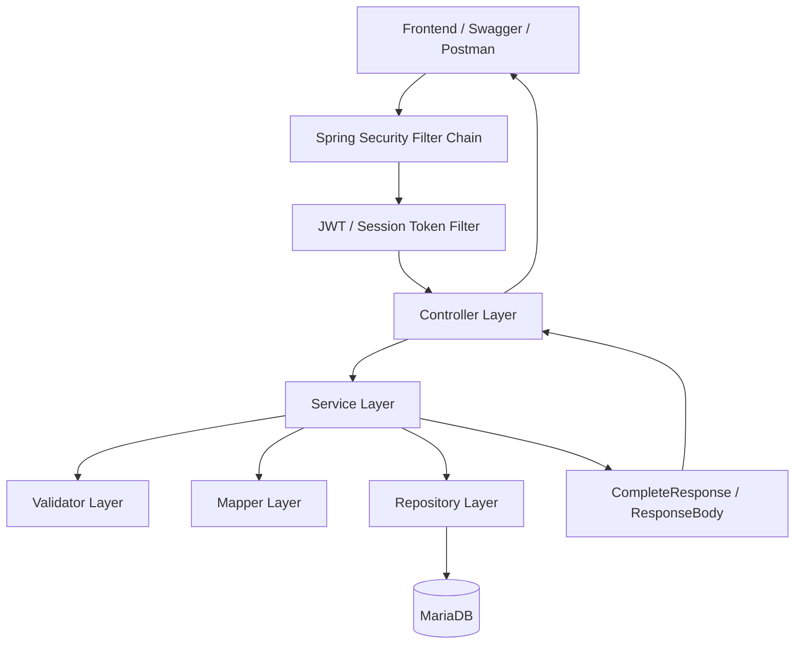

# WanderMate Backend

Spring Boot backend for the WanderMate travel planning application. The backend provides authentication, refresh/session token handling, OTP verification, trip/destination/activity management, ownership checks, validation, Docker-based local setup, tests, CI/CD, and Render deployment configuration.

This backend is written as a portfolio-grade API project. It demonstrates real backend concerns such as secure authentication, token lifecycle management, database-backed configuration, relational modelling, business validation, testable service design, production profiles, and production-safe documentation.

---

## Tech Stack

| Area | Technology |
|---|---|
| Language | Java 21 |
| Framework | Spring Boot 3.5.4 |
| Database | MariaDB |
| ORM | Spring Data JPA / Hibernate |
| Security | Spring Security, JWT, refresh tokens, session tokens |
| Email / OTP | Spring Mail, OAuth/email configuration |
| API documentation | SpringDoc OpenAPI / Swagger for local development |
| Build tool | Maven |
| Testing | JUnit 5, Mockito, Spring MockMvc, Maven Surefire |
| Containerization | Docker, Docker Compose |
| Deployment | Render |
| CI/CD | GitHub Actions + Render deploy hook |

---

## Current Status

```text
✅ User registration, login, logout, forgot password
✅ Password hashing and safe auth responses
✅ JWT access token authentication
✅ Refresh token rotation, revocation, and reuse detection
✅ Session token handling for active login sessions
✅ Max active session enforcement
✅ Email OTP implemented end-to-end when email secrets/config are provided
✅ OTP expiry, retry/block handling, destination matching, and consume-on-success
✅ Forgot-password validates the new password before consuming OTP
✅ Registration and forgot-password flows are transaction-protected
✅ Phone/SMS OTP service path exists and is covered with mocked unit tests
✅ Trip, destination, and activity CRUD implemented
✅ Trip/destination/activity date and time validation implemented
✅ Trip and destination overlap warnings implemented with allowOverlap support
✅ Activity overlap blocked as a hard validation error
✅ Ownership checks protect user-specific data
✅ Standardized response wrapper and error code system
✅ Swagger UI available locally
✅ Swagger/OpenAPI disabled in production profile
✅ Docker Compose local backend + MariaDB setup
✅ Production profile available for Render deployment
✅ Public health endpoint implemented
✅ Backend CI/CD runs tests before triggering Render deployment
✅ Focused backend service/controller test suite has 216 passing tests
```

Not enabled yet:

```text
⚠️ Real SMS provider integration is not enabled
⚠️ Public Docker/demo values do not include real email/OAuth secrets
```

Important OTP note: email OTP is the real working OTP flow when email secrets/config are provided. Phone/SMS OTP is prepared at service level and covered with mocked tests, but the current SMS service does not send real SMS.

---

## Architecture Summary



Layering:

```text
Controller → Service → Validator / Mapper → Repository → Database
```

Key design choices:

```text
- Controllers stay thin and delegate business logic to services
- Validators keep input/business rule validation separate from service orchestration
- Repositories isolate persistence logic
- Response wrappers keep API responses consistent
- Error codes provide stable frontend mapping
- Ownership checks prevent cross-user access
- Token/session data is stored and revocable server-side
```

---

## Domain Model

```text
User
└── Trip
    ├── Destination
    │   └── Activity
    └── Activity can also reference the parent Trip for trip-wide overlap validation
```

Main entities:

```text
UserEntity
TripEntity
TripDestinationEntity
ActivityEntity
OtpCheckEntity
RefreshTokenEntity
SessionTokenStoreEntity
ConfigurationEntity
ErrorCodeEntity
```

Business rules:

```text
- Usernames, emails, and phone numbers are unique
- Users can only access their own trips
- Trips require valid start/end dates
- Destinations must belong to a trip
- Destinations must fit within the parent trip date range
- Activities must belong to a trip and destination
- Activities must fit within the parent destination/trip range
- Trip overlaps can return a warning and continue with allowOverlap=true
- Destination overlaps can return a warning and continue with allowOverlap=true
- Activity overlaps are blocked as hard conflicts
```

---

## Live Backend

Production backend on Render:

```text
https://wandermate-fullstack.onrender.com/The-Project
```

Health endpoint:

```text
https://wandermate-fullstack.onrender.com/The-Project/api/v1/health
```

Expected response:

```json
{
  "status": "UP",
  "service": "WanderMate backend"
}
```

Render free-tier services may sleep when inactive, so the first request can take around 40-60 seconds to wake up.

---

## Local Development

Run with Maven:

```bash
cd backend
./mvnw spring-boot:run
```

Windows PowerShell:

```powershell
cd backend
.\mvnw spring-boot:run
```

Default local backend URL:

```text
http://localhost:8080/The-Project
```

Health check:

```text
http://localhost:8080/The-Project/api/v1/health
```

Swagger UI:

```text
http://localhost:8080/The-Project/swagger-ui/index.html
```

---

## Docker Setup

From the backend folder:

```bash
cd backend
cp .env.example .env
docker compose up --build
```

Windows PowerShell:

```powershell
cd backend
copy .env.example .env
docker compose up --build
```

Docker backend URL:

```text
http://localhost:8082/The-Project
```

Docker health endpoint:

```text
http://localhost:8082/The-Project/api/v1/health
```

Docker Swagger UI:

```text
http://localhost:8082/The-Project/swagger-ui/index.html
```

MariaDB host connection:

```text
localhost:3307
```

Inside Docker, the backend connects to MariaDB by service name:

```env
DB_URL=jdbc:mariadb://db:3306/traveling_app
```

From the host machine, database tools connect using:

```text
localhost:3307
```

---

## Environment Variables

The backend uses `.env.example` as a safe template. Real `.env` values should not be committed.

Common local variables:

```env
DB_URL=jdbc:mariadb://localhost:3307/traveling_app
DB_USERNAME=your_database_username
DB_PASSWORD=your_database_password
JWT_SECRET_KEY=your_local_jwt_secret
SPRING_PROFILES_ACTIVE=dev
```

Email OTP requires valid email/OAuth configuration. Public demo values should not include real secrets.

---

## Production Profile

Render uses:

```text
SPRING_PROFILES_ACTIVE=prod
```

The production profile is used to reduce development-only behaviour:

```text
- Disable SQL debug output
- Reduce noisy debug logging
- Disable Swagger/OpenAPI UI in production
```

Production API documentation is handled through markdown docs instead of public Swagger:

```text
backend/docs/PRODUCTION_API_DOCS.md
backend/docs/API_GUIDE.md
backend/docs/AUTH_FLOW.md
backend/docs/POSTMAN_GUIDE.md
```

---

## Authentication Overview

Login returns:

```text
accessToken
refreshToken
sessionToken
```

Protected requests require:

```text
Authorization: Bearer <accessToken>
Session-Token: <sessionToken>
```

Refresh token requests require:

```text
Refresh-Token: <refreshToken>
Session-Token: <sessionToken>
```

Logout revokes the active session and related refresh tokens.

Max active session behaviour:

```text
1. User logs in normally
2. Backend checks active session count
3. If max sessions reached and overrideMaxSession=false, backend returns max-session error
4. Frontend asks the user to confirm removing the oldest session
5. If user confirms, frontend retries with overrideMaxSession=true
6. Backend revokes old session(s) and allows login
```

More details: [`docs/AUTH_FLOW.md`](docs/AUTH_FLOW.md)

---

## OTP and Password Reset Behaviour

OTP behaviour:

```text
- OTP is generated for email or prepared phone/SMS flows
- OTP destination is bound to the original email or phone number
- OTP has expiry validation
- Incorrect/expired OTP attempts increase retry count
- OTP record can be blocked after max retry attempts
- Successful OTP verification deletes the OTP record to prevent reuse
```

Password reset behaviour:

```text
1. Find user by username/email/phone
2. Validate new password pattern
3. Reject password if it matches the old password
4. Verify OTP only after password checks pass
5. Consume OTP on successful verification
6. Save encoded new password
```

`forgotPassword()` is transaction-protected so OTP consumption and password update stay consistent if a later database operation fails.

---

## Main API Areas

| Module | Purpose |
|---|---|
| Users | Register, verify registration details, login, forgot password, logout, check user |
| OTP | Send and verify OTP through email flow or prepared SMS flow |
| Auth | Refresh access token using refresh token + session token |
| Trips | Create, list, detail, update, delete trips; overlap warning support |
| Destinations | Create, list, detail, update, delete destinations under trips; overlap warning support |
| Activities | Create, list, detail, update, delete activities under destinations; overlap blocking |
| Health | Public API health check for deployment monitoring |

More details: [`docs/API_GUIDE.md`](docs/API_GUIDE.md)

---

## Tests

Run all backend tests:

```bash
cd backend
./mvnw test
```

Windows PowerShell:

```powershell
cd backend
.\mvnw test
```

Focused backend suite status:

```text
216 passed
0 failures
0 errors
0 skipped
```

Service tests:

```text
ActivityServiceImplTest      25 passed
DestinationServiceImplTest   31 passed
EmailServiceImplTest          9 passed
OtpServiceImplTest           30 passed
SmsServiceImplTest            3 passed
TokenServiceImplTest         33 passed
TripServiceImplTest          39 passed
UserServiceImplTest          35 passed

Total service tests: 205 passed
```

Controller/API tests:

```text
HealthControllerImplTest       1 passed
UserControllerImplTest         1 passed
TripControllerImplTest         2 passed
DestinationControllerImplTest  1 passed
ActivityControllerImplTest     1 passed
OtpControllerImplTest          3 passed
TokenControllerImplTest        2 passed

Total controller/API tests: 11 passed
```

Coverage includes:

```text
- Auth login/logout/session behaviour
- Refresh token rotation, revocation, and reuse detection
- User registration validation
- OTP send/verify retry, expiry, destination mismatch, and consume-on-success
- Forgot-password password validation before OTP consumption
- Trip/destination/activity CRUD business rules
- Ownership checks
- Trip/destination overlap warnings
- Activity overlap blocking
- Controller/API status mapping and edge cases
```

Note: a generated full Spring `contextLoads` test, if reintroduced, may require real DB env variables or a dedicated test profile because it starts the full Spring application context. The main portfolio test proof is the focused service/controller test suite.

More details: [`docs/TESTING.md`](docs/TESTING.md)

---

## CI/CD

Workflow file:

```text
.github/workflows/backend-ci-cd.yml
```

Flow:

```text
Pull request / push to main
→ Set up Java 21
→ Run ./mvnw -B test
→ On push to main, trigger Render deploy hook
```

Render deploy hook secret:

```text
RENDER_DEPLOY_HOOK_URL
```

---

## Documentation Index

| Document | Purpose |
|---|---|
| [`docs/API_GUIDE.md`](docs/API_GUIDE.md) | Endpoints, request bodies, headers, response format |
| [`docs/AUTH_FLOW.md`](docs/AUTH_FLOW.md) | Login, refresh, logout, OTP, session/token logic |
| [`docs/ARCHITECTURE.md`](docs/ARCHITECTURE.md) | Layers, domain model, ownership checks, validation rules |
| [`docs/DATABASE_SEED.md`](docs/DATABASE_SEED.md) | Seed file purpose and safe data rules |
| [`docs/DOCKER_SETUP.md`](docs/DOCKER_SETUP.md) | Docker setup and troubleshooting |
| [`docs/POSTMAN_GUIDE.md`](docs/POSTMAN_GUIDE.md) | Manual API testing flow |
| [`docs/TESTING.md`](docs/TESTING.md) | Test coverage and test commands |
| [`docs/FRONTEND_INTEGRATION.md`](docs/FRONTEND_INTEGRATION.md) | Frontend URL, token, refresh, and warning handling |
| [`docs/PRODUCTION_API_DOCS.md`](docs/PRODUCTION_API_DOCS.md) | Production-safe API documentation strategy |
| [`docs/OPERATIONS.md`](docs/OPERATIONS.md) | Health check, production profile, logging, deployment troubleshooting |
| [`docs/ROADMAP.md`](docs/ROADMAP.md) | Suggested V1/V2/V2.5/V3/V4 improvement plan |

---

## Security and Secret Handling

Do not commit:

```text
.env files
OAuth refresh tokens
Access tokens
Database dumps with private data
Generated target/ files
```

Use `.env.example` for safe templates and cloud provider environment settings for real deployment values.

---

## Current Next Phase

Backend V2 is complete and supports the polished frontend V2.5 flow.

Next project phase:

```text
V3 portfolio proof:
1. Take screenshots
2. Record 60-90 second demo video
3. Add screenshot/demo section to root README
4. Add final project summary to CV/GitHub portfolio
```
