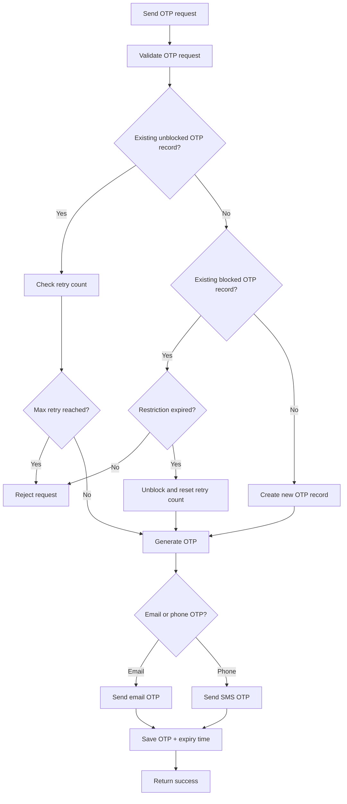

# API Guide

This document summarizes the main API areas in the WanderMate / Travelling App backend.

---

## Base URL

Local IntelliJ run:

```text
http://localhost:8080/The-Project
```

Docker run using host port `8082`:

```text
http://localhost:8082/The-Project
```

Swagger UI for local IntelliJ run:

```text
http://localhost:8080/The-Project/swagger-ui/index.html
```

Swagger UI for Docker run:

```text
http://localhost:8082/The-Project/swagger-ui/index.html
```

If the application context path changes later, remove or update `/The-Project`.

---

## Public APIs

These APIs do not require an access token:

```text
POST /api/v1/users/register
POST /api/v1/users/login
POST /api/v1/auth/refresh
POST /api/v1/users/forgot-password
POST /api/v1/users/register/verify
POST /api/v1/otp/send
POST /api/v1/otp/verify
GET  /api/v1/users/check
GET  /swagger-ui/**
GET  /v3/api-docs/**
```

Important note:

```text
/api/v1/auth/refresh is public from the access-token filter perspective,
but it still requires Refresh-Token and Session-Token headers.
```

The public URL list is configured through the database configuration table.

---

## Protected APIs

Protected APIs require both headers:

```text
Authorization: Bearer <accessToken>
Session-Token: <sessionToken>
```

Protected modules include:

- Trip APIs
- Destination APIs
- Activity APIs
- Logout API
- Any user-specific resource API

---

## User and Auth APIs

Main responsibilities:

- Register user
- Login user
- Check user details
- Forgot password
- Refresh access token
- Logout/revoke session

Typical auth flow:

```text
Register → Login → Use accessToken + sessionToken → Refresh token when needed → Logout
```

---

## OTP APIs

Main responsibilities:

- Send OTP through email or SMS flow
- Verify OTP
- Track OTP retry count
- Temporarily block OTP after too many failed attempts

OTP flow:



---

## Trip APIs

Main responsibilities:

- Create trip
- Get trips for authenticated user
- Get trip detail
- Update trip
- Delete trip
- Search/suggest cities, restaurants, and accommodations
- Validate duplicate trip names per user
- Warn about trip overlap
- Block trip updates that exclude existing destinations

Important rule:

```text
Users can only access and modify their own trips.
```

Routes:

```text
GET    /api/v1/trips
GET    /api/v1/trips/{tripId}
POST   /api/v1/trips
PUT    /api/v1/trips/{tripId}
DELETE /api/v1/trips/{tripId}
```

---

## Destination APIs

Main responsibilities:

- Create destination inside a trip
- Get destinations for a trip
- Get destination detail
- Update destination
- Delete destination
- Validate destination date range inside trip date range
- Warn about destination overlap inside the same trip

Routes:

```text
GET    /api/v1/trips/{tripId}/destinations
GET    /api/v1/trips/{tripId}/destinations/{destinationId}
POST   /api/v1/trips/{tripId}/destinations
PUT    /api/v1/trips/{tripId}/destinations/{destinationId}
DELETE /api/v1/trips/{tripId}/destinations/{destinationId}
```

Important rule:

```text
Deleting a destination deletes all activities inside that destination.
```

---

## Activity APIs

Main responsibilities:

- Create activity inside a destination
- Get activities for a destination
- Get activity detail
- Update activity
- Delete activity
- Validate activity date/time range inside destination date range
- Block activity time overlap

Routes:

```text
GET    /api/v1/trips/{tripId}/destinations/{destinationId}/activities
GET    /api/v1/trips/{tripId}/destinations/{destinationId}/activities/{activityId}
POST   /api/v1/trips/{tripId}/destinations/{destinationId}/activities
PUT    /api/v1/trips/{tripId}/destinations/{destinationId}/activities/{activityId}
DELETE /api/v1/trips/{tripId}/destinations/{destinationId}/activities/{activityId}
```

Activity overlap rule:

```text
newStart < existingEnd AND newEnd > existingStart
```

If both conditions are true, the new activity overlaps with an existing activity.

Back-to-back activities are allowed:

```text
Existing activity: 10:00 - 12:00
New activity:      12:00 - 13:00
Result: allowed
```

Overlapping activities are blocked:

```text
Existing activity: 10:00 - 12:00
New activity:      11:00 - 13:00
Result: blocked
```

---

## Soft Warning vs Hard Error

### Soft Warnings

Soft warnings allow the frontend to ask the user whether they want to continue.

```text
TRIP_OVERLAP_WARNING
DESTINATION_OVERLAP_WARNING
```

Frontend flow:

```text
Request with allowOverlap = false
  ↓
Backend detects overlap
  ↓
Backend returns warning
  ↓
Frontend shows confirmation popup
  ↓
User confirms
  ↓
Frontend sends same request with allowOverlap = true
  ↓
Backend saves data
```

### Hard Errors

Hard errors cannot be bypassed by the user.

Examples:

```text
TRIP_NAME_ALREADY_EXISTS
TRIP_DATE_CONFLICT_WITH_DESTINATION
DESTINATION_DATE_OUTSIDE_TRIP_RANGE
ACTIVITY_OUTSIDE_DESTINATION_RANGE
ACTIVITY_OVERLAP_ERROR
```

---

## Standard Response

The backend uses a standardized response structure through `CompleteResponse` and `ResponseBody`.

Benefits:

- Consistent success/error format
- Error codes are database-backed
- Easier frontend handling
- Easier API testing

---

## Swagger Testing

Swagger can be used for manual API testing.

For protected APIs:

1. Login and copy the access token and session token.
2. Click `Authorize` in Swagger and enter the Bearer access token.
3. Add `Session-Token` where the endpoint/header is supported.
4. If an endpoint does not expose the `Session-Token` header in Swagger yet, test that protected endpoint in Postman.

Recommended future improvement:

```text
Add a global OpenAPI security/header scheme for Session-Token.
```
