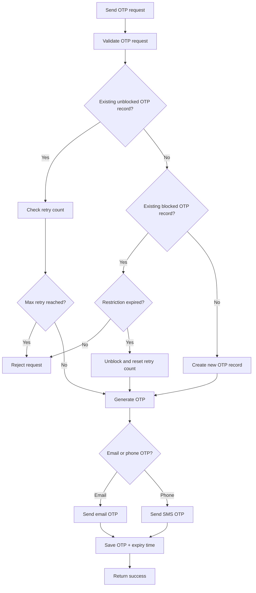
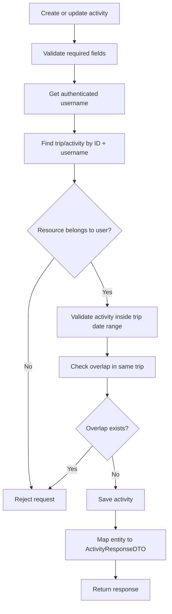

# API Guide

This document summarizes the main API areas in the Travelling App backend.

---

## Base URL

Local IntelliJ run:

```text
http://localhost:8080/The-Project
```

Docker run using host port `8081`:

```text
http://localhost:8081/The-Project
```

Swagger UI:

```text
http://localhost:8081/The-Project/swagger-ui/index.html
```

---

## Public APIs

These APIs do not require an access token:

```text
POST /api/v1/users/register
POST /api/v1/users/login
POST /api/v1/auth/refresh
POST /api/v1/users/forgot-password
POST /api/v1/users/register/verify
POST /api/v1/otp/send
POST /api/v1/otp/verify
GET  /api/v1/users/check
GET  /swagger-ui/**
GET  /v3/api-docs/**
```

Important note:

```text
/api/v1/auth/refresh is public from the access-token filter perspective,
but it still requires Refresh-Token and Session-Token headers.
```

The public URL list is configured through the database configuration table.

---

## Protected APIs

Protected APIs require both headers:

```text
Authorization: Bearer <accessToken>
Session-Token: <sessionToken>
```

Protected modules include:

- Trip APIs
- Activity APIs
- Logout API
- Any user-specific resource API

---

## User and Auth APIs

Main responsibilities:

- Register user
- Login user
- Check user details
- Forgot password
- Refresh access token
- Logout/revoke session

Typical auth flow:

```text
Register → Login → Use accessToken + sessionToken → Refresh token when needed → Logout
```

---

## OTP APIs

Main responsibilities:

- Send OTP through email or SMS flow
- Verify OTP
- Track OTP retry count
- Temporarily block OTP after too many failed attempts

OTP flow:



---

## Trip APIs

Main responsibilities:

- Create trip
- Get trips for authenticated user
- Get trip detail
- Update trip
- Delete trip
- Search/suggest cities, restaurants, and accommodations

Important rule:

```text
Users can only access and modify their own trips.
```

---

## Activity APIs

Main responsibilities:

- Create activity inside a trip
- Get activities for a trip
- Get activity detail
- Update activity
- Delete activity
- Validate activity date range and time overlap

Activity overlap rule:

```text
newStart < existingEnd AND newEnd > existingStart
```

If both conditions are true, the new activity overlaps with an existing activity.



---

## Standard Response

The backend uses a standardized response structure through `CompleteResponse` and `ResponseBody`.

Benefits:

- Consistent success/error format
- Error codes are database-backed
- Easier frontend handling
- Easier API testing

---

## Swagger Testing

Swagger can be used for manual API testing.

For protected APIs:

1. Login and copy the access token and session token.
2. Click `Authorize` in Swagger and enter the Bearer access token.
3. Add `Session-Token` where the endpoint/header is supported.
4. If an endpoint does not expose the `Session-Token` header in Swagger yet, test that protected endpoint in Postman.

Recommended future improvement:

```text
Add a global OpenAPI security/header scheme for Session-Token.
```
