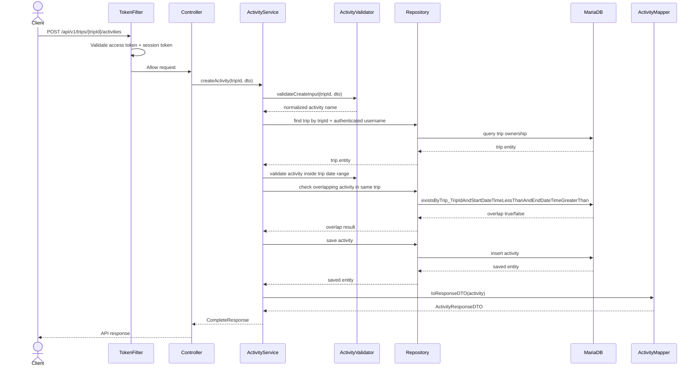

# Backend Architecture

This document explains the backend structure of the Travelling App backend.

---

## High-Level Architecture


---

## Layer Responsibilities

### Controller Layer

The controller layer handles HTTP requests and responses.

Responsibilities:

- Receive API requests
- Bind request body, headers, path variables, and query parameters
- Call service methods
- Return standardized responses

The controller should not contain complex business logic.

---

### Security Layer

The security layer protects authenticated routes before requests reach controllers.

Responsibilities:

- Skip token validation for public URLs
- Extract and validate Bearer access tokens
- Validate `Session-Token` for protected requests
- Populate `SecurityContext` with authenticated user information
- Reject invalid or expired authentication attempts

---

### Service Layer

The service layer contains business logic.

Responsibilities:

- Authentication flow
- Token generation and validation
- Refresh token rotation/revocation
- Trip and activity business rules
- OTP flow
- Ownership checks
- Calling validators, mappers, and repositories

This is the main layer where application behaviour is coordinated.

---

### Validator Layer

The validator layer keeps validation logic separate from service logic.

Responsibilities:

- Validate required fields
- Validate date/time rules
- Validate OTP request type
- Validate trip/activity rules
- Validate business conditions before service actions continue

---

### Mapper Layer

The mapper layer converts between entities and DTOs.

Responsibilities:

- Convert entity to response DTO
- Keep response formatting outside service logic
- Avoid exposing internal entity structure directly

---

### Repository Layer

The repository layer handles database access.

Responsibilities:

- Query entities
- Save/update/delete records
- Provide ownership-based lookup methods

Example ownership-based query pattern:

```text
findByTripIdAndUser_Username(...)
findByActivityIdAndTrip_TripIdAndTrip_User_Username(...)
```

This helps ensure a user can only access their own resources.

---

## Activity Creation Flow Example



---

## Why This Structure Is Useful

This architecture makes the backend easier to maintain because each layer has a clear responsibility.

Benefits:

- Easier to debug
- Easier to test
- Cleaner service classes
- Better separation of concerns
- More professional backend structure for a portfolio project
