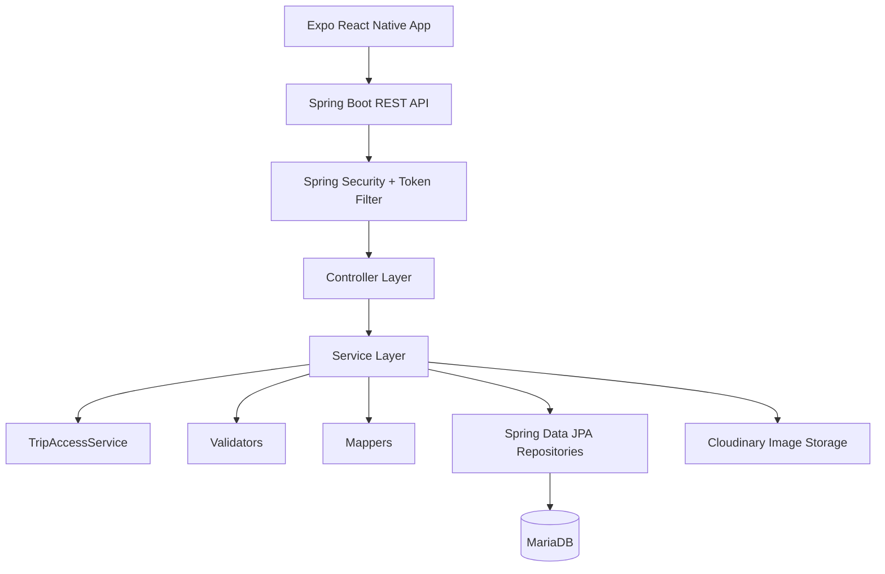

# Backend Architecture

This document explains the backend structure and main design decisions for WanderMate.

## Summary

WanderMate backend is a Spring Boot REST API for a mobile trip planning and collaboration app.

Main responsibilities:

```text
- user registration/login/OTP/password reset
- JWT access token, refresh token, and session token lifecycle
- trip, destination, and activity persistence
- owner/editor/viewer collaboration access control
- invitations, join requests, and share-code joining
- Cloudinary image upload metadata flow
- standardized API responses and database-backed error messages
- Docker/Render deployment support
```

## High-Level Flow



The main request path is:

```text
Controller -> Service -> Access Control / Validator -> Repository -> Mapper -> Response
```

## Package Structure

```text
com.example.travellingapp
├── config              # Spring Security, Swagger/OpenAPI, mail config
├── controller          # Controller interfaces
├── controller.impl     # Controller implementations
├── dto                 # Request/response DTOs
├── entity              # JPA entities
├── enums               # Error enums, flow enums, shared enum values
├── exception_handler   # Global exception handling
├── mapper              # Entity-to-DTO mapping
├── repository          # Spring Data JPA repositories
├── response_template   # Standard response wrappers
├── security            # Token filter, auth helpers, hashing
├── service             # Service interfaces
├── service.impl        # Business logic implementations
├── util                # Utility classes
└── validator           # Business validation helpers
```

## Core Domain Model

```text
User
 ├── owns Trips
 ├── collaborates through TripMember
 └── sends/receives TripCollaborationRequest

Trip
 ├── has many TripDestination
 ├── has many TripMember
 ├── has many TripShareCode
 └── has cover image metadata

TripDestination
 ├── belongs to Trip
 ├── has many DestinationActivity
 └── has created/modified user attribution

DestinationActivity
 ├── belongs to TripDestination
 └── has created/modified user attribution
```

## Collaboration Model

Trip access is role-based:

| Role | Can view | Can edit planning content | Can manage collaboration | Can delete trip |
|---|---:|---:|---:|---:|
| `OWNER` | Yes | Yes | Yes | Yes |
| `EDITOR` | Yes | Yes | No | No |
| `VIEWER` | Yes | No | No | No |

Important services:

```text
TripAccessServiceImpl
TripMemberServiceImpl
TripCollaborationRequestServiceImpl
TripShareCodeServiceImpl
TripOverlapWarningServiceImpl
CollaborationSummaryServiceImpl
```

`TripAccessServiceImpl` centralizes access checks:

```text
getTripIfCanView
getTripIfCanEdit
getTripIfOwner
assertCanView
assertCanEdit
assertIsOwner
```

This avoids repeating permission logic inside every trip/destination/activity service.

## Authentication Model

After login, the backend returns:

```text
accessToken
refreshToken
sessionToken
```

The access token is a short-lived JWT. The refresh token is stored as a hash in the database. The session token is encoded and stored separately to validate active device sessions.

Main auth services:

```text
UserServiceImpl
TokenServiceImpl
OtpServiceImpl
```

Security entry point:

```text
SecurityConfig -> TokenFilter -> SecurityContext
```

## Image Storage Model

Images are uploaded to Cloudinary via:

```text
POST /api/v1/uploads/images
```

The upload API returns:

```text
imageUrl
publicId
```

The frontend then saves those fields through:

```text
PATCH /api/v1/users/me/profile
PUT   /api/v1/trips/{tripId}
```

Cloudinary cleanup is handled by comparing old and new `publicId` values. If the public ID changes, the old image is deleted. Cleanup failures are logged and should not fail the main profile/trip update.

## Response Pattern

Service methods usually return:

```java
CompleteResponse<Object>
```

Controllers return:

```java
ResponseEntity<ResponseBody<Object>>
```

The API response shape stays consistent across success and business-error flows.

## Validation Model

Validation is split across DTO validation and explicit validator/service checks.

Examples:

```text
TripValidator
DestinationValidator
ActivityValidator
TripShareCodeValidator
TripCollaborationRequestValidator
```

Important validation rules:

```text
- trip start/end must be valid
- destination dates must stay inside trip date range
- activity times must stay inside destination date range
- activities cannot overlap
- trip name must be unique per user
- editors/viewers cannot manage members
- owners cannot remove themselves or assign OWNER manually
- share code must be active, unexpired, and not abused
```

## Database Strategy

Current local development uses:

```properties
spring.jpa.hibernate.ddl-auto=update
```

This is acceptable for the current portfolio phase. For a more production-grade version, replace it with migrations:

```text
Flyway or Liquibase
```

The local Docker database should not use a raw production dump. It should start from a clean DB plus safe reference seed data.

## Deployment Model

Local:

```text
Spring Boot + MariaDB local or Docker Compose
```

Production:

```text
Render backend service + external MariaDB + Cloudinary
```

Production profile disables Swagger UI and OpenAPI docs.

## Known Technical Debt

Not blockers for V4 portfolio proof:

```text
- Split the broad TripEnum into smaller enums
- Add @Transactional to all multi-write service methods
- Replace ddl-auto=update with Flyway/Liquibase
- Add Testcontainers integration tests
- Add frontend E2E tests
```
