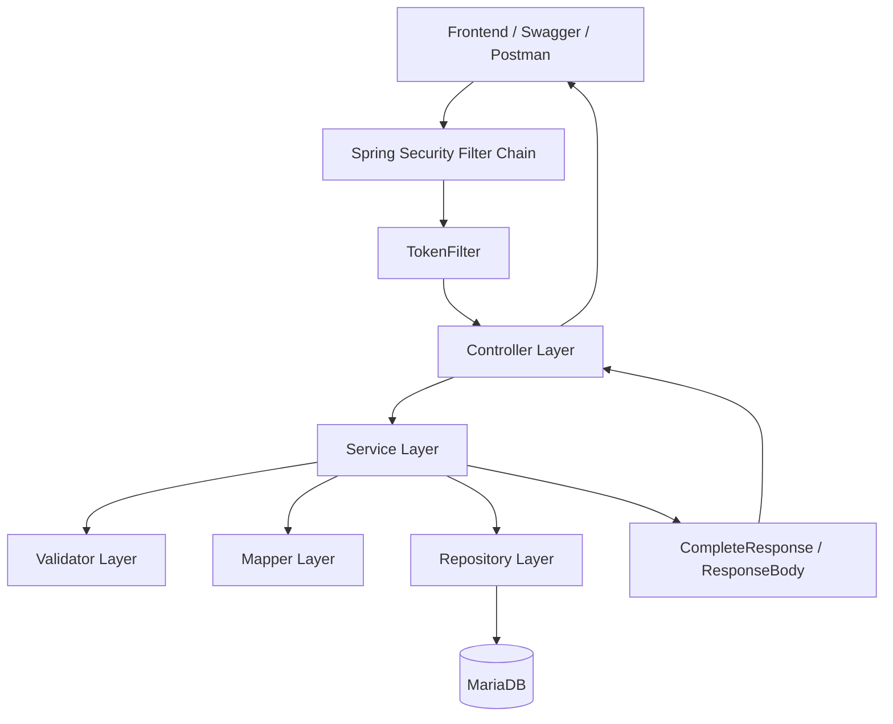
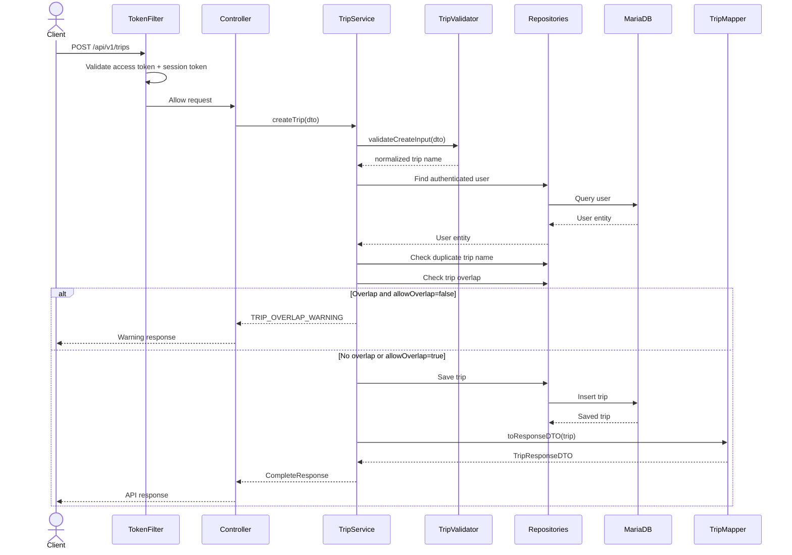
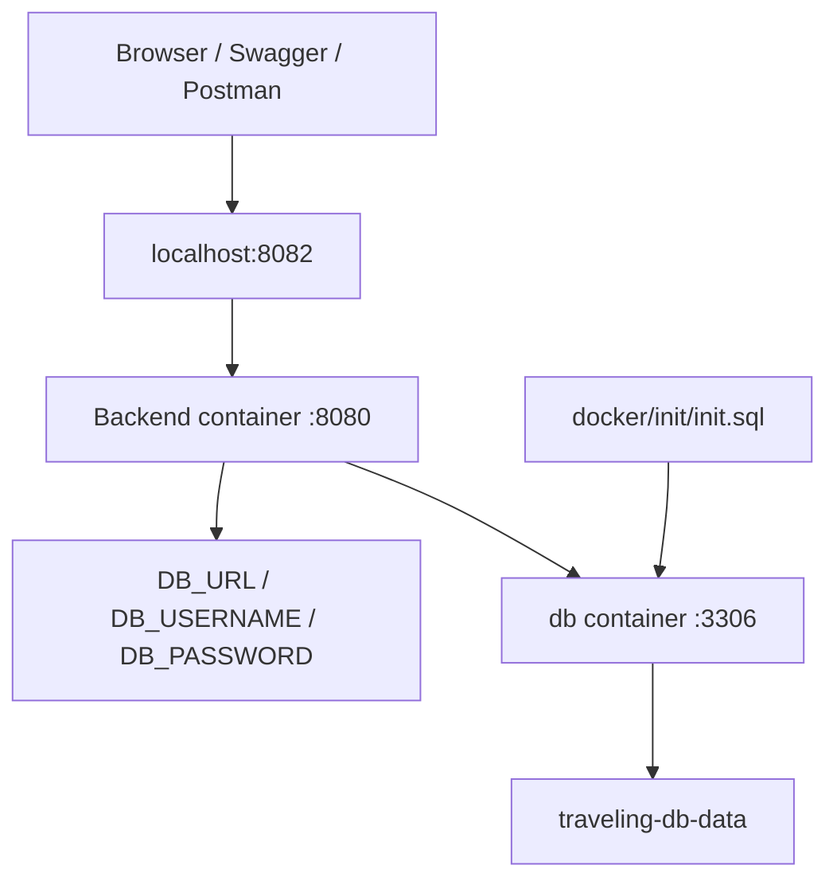
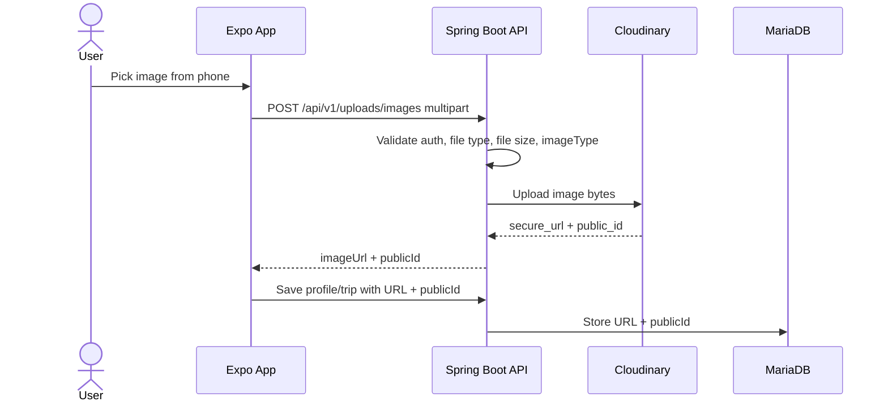

# Backend Architecture

This document explains the backend structure of the WanderMate / Travelling App backend.

---

## High-Level Architecture



The code follows this structure:

```text
Controller → Service → Access Control / Validator / Mapper → Repository → Database
```

---

## Package Structure

```text
com.example.travellingapp
├── config              # Spring Security, Swagger/OpenAPI, Mail config
├── controller          # Controller interfaces
├── controller.impl     # Controller implementations
├── dto                 # Request and response DTOs
├── entity              # JPA entities
├── enums               # Error codes, flows, email/sms enums
├── exception_handler   # Global exception handling
├── mapper              # Entity to response DTO mapping
├── repository          # Spring Data JPA repositories
├── response_template   # Standard API response wrappers
├── security            # Token filter, authenticated user helpers, hashing
├── service             # Service interfaces
├── service.impl        # Business logic implementations
├── util                # Shared helpers
└── validator           # Validation logic
```

---

## Core Domain Model

```text
User
  └── Trip
        └── Destination
              └── Activity
```

A user owns trips. Each trip can contain multiple destinations. Each destination can contain multiple activities.

The route design follows the same hierarchy:

```text
/api/v1/trips/{tripId}/destinations/{destinationId}/activities/{activityId}
```

---

## Layer Responsibilities

### Controller Layer

Responsibilities:

- Receive HTTP requests
- Bind request bodies, headers, path variables, and query parameters
- Call service methods
- Convert `CompleteResponse` into `ResponseEntity`

Controllers should not contain complex business logic.

### Security Layer

Responsibilities:

- Skip token validation for public routes
- Extract and validate Bearer access token
- Validate `Session-Token`
- Populate `SecurityContext` with authenticated user details
- Reject invalid/expired token/session requests

### Service Layer

Responsibilities:

- Authentication flow
- Token generation, refresh, revocation, and reuse detection
- OTP send/verify flow
- Trip/destination/activity business rules
- Ownership checks
- Calling validators, mappers, and repositories

### Validator Layer

Responsibilities:

- Required field validation beyond DTO annotations
- Date/time rules
- OTP method-specific checks
- Format checks
- Business preconditions before data is saved

### Mapper Layer

Responsibilities:

- Convert entities to response DTOs
- Avoid returning internal JPA entity objects directly
- Keep response structure consistent

### Repository Layer

Responsibilities:

- Query, save, update, and delete data
- Provide ownership-aware lookup methods
- Support overlap and conflict checks

---

## Authorization Pattern

Ownership is enforced by querying through the authenticated username.

Example patterns:

```text
Trip:        findByTripIdAndUser_Username(...)
Destination: findByDestinationIdAndTrip_TripIdAndTrip_User_Username(...)
Activity:    findByActivityIdAndDestination_DestinationIdAndDestination_Trip_TripIdAndDestination_Trip_User_Username(...)
```

This ensures users can only access resources connected to their own account.

---

## Response Pattern

Service methods return:

```java
CompleteResponse<Object>
```

Controller methods return:

```java
ResponseEntity<ResponseBody<Object>>
```

Standard response shape:

```json
{
  "code": "E000",
  "message": "Trip created successfully",
  "flow": "TRIP",
  "body": {}
}
```

Benefits:

- Consistent success/error response structure
- Business code is separated from HTTP status
- Error messages can be database-backed through `ErrorCodeEntity`

---

## Authentication Components

```text
SecurityConfig
  └── Configures public/protected routes and installs TokenFilter

TokenFilter
  └── Validates access token + session token for protected requests

TokenServiceImpl
  ├── Generates JWT access token
  ├── Generates and hashes refresh token
  ├── Generates and encodes session token
  ├── Rotates refresh token
  ├── Detects refresh token reuse
  └── Revokes session/refresh tokens
```

---

## Validation Rules

### Trip Rules

- Trip name is required and length-limited.
- Destination is required.
- Start/end dates are required.
- Start date must be before end date.
- Start date cannot be in the past.
- Trip name must be unique per user.
- Trip overlap returns warning `TRIP_OVERLAP_WARNING` unless `allowOverlap=true`.
- Trip update cannot exclude existing destinations.

### Destination Rules

- Destination name is required.
- Start/end dates are required.
- Start date must be before end date.
- Start date cannot be in the past.
- Destination must stay inside parent trip range.
- Destination overlap returns warning `DESTINATION_OVERLAP_WARNING` unless `allowOverlap=true`.
- Destination update cannot exclude existing activities.

### Activity Rules

- Activity name is required.
- Start/end date-times are required.
- Start time must be before end time.
- Activity must stay inside destination range.
- Activity overlap is a hard error.

Overlap logic:

```text
newStart < existingEnd AND newEnd > existingStart
```

---

## Trip Creation Flow



---

## Docker Runtime Architecture



Important:

```text
Inside Docker: db:3306
From host machine: localhost:3307
```

---

## Current Design Strengths

- Clear layered backend structure
- Strong service-level test coverage
- Auth design includes access token, refresh token, and session token
- Refresh token reuse detection is implemented
- Ownership-aware repository lookups protect user data
- Trip/destination/activity hierarchy is modelled cleanly
- Docker Compose gives a reproducible local backend environment

---

## Current Design Limitations

- SMS/phone OTP is not connected to a real SMS provider.
- Public Docker demo does not include real email/OAuth secrets.
- Swagger is currently part of the app; for production, it should be restricted or disabled.
- The generated full-context Spring Boot test needs DB env variables or a dedicated test profile.
- Frontend environment switching is currently manual through `src/constants/env.ts`.

## V3 Collaboration Architecture

The project now uses role-based collaboration instead of simple owner-only access.

```text
TripEntity
├── TripMemberEntity
│   ├── OWNER
│   ├── EDITOR
│   └── VIEWER
├── TripCollaborationRequestEntity
│   ├── INVITATION
│   └── JOIN_REQUEST
└── TripShareCodeEntity
```

`TripAccessService` centralizes these checks:

```text
getTripIfOwner
getTripIfCanEdit
getTripIfMember
assertCanView
assertCanEdit
```

This keeps permission logic out of controllers and avoids duplicating access checks in every service.

## V3 Attribution and Profile Model

V3 adds user-facing profile fields and content attribution.

```text
users.display_name
users.preferred_theme
users.profile_image_url
users.profile_image_public_id

trip_destinations.created_by_user_id
trip_destinations.modified_by_user_id

destination_activities.created_by_user_id
destination_activities.modified_by_user_id
```

The frontend uses these fields to show creator/last-editor avatars and quick user cards on destination and activity screens.

---

## Cloudinary Image Storage Architecture

WanderMate stores profile images and trip cover images in Cloudinary rather than in the backend filesystem.



Stored fields:

```text
users.profile_image_url
users.profile_image_public_id

trips.cover_image_url
trips.cover_image_public_id
```

Folder strategy:

```text
wandermate/profile-images/users/{userId}
wandermate/trip-covers/users/{userId}
```

The folder uses `userId` instead of username because user IDs are stable and usernames may change.

Cleanup strategy:

```text
- Replace profile picture → delete old profile_image_public_id from Cloudinary.
- Remove profile picture → delete old profile_image_public_id from Cloudinary.
- Replace trip cover → delete old cover_image_public_id from Cloudinary.
- Remove trip cover → delete old cover_image_public_id from Cloudinary.
- Delete trip → delete old trip cover from Cloudinary.
```

The backend logs Cloudinary deletion failures as warnings so that profile/trip updates do not fail only because cleanup failed.
