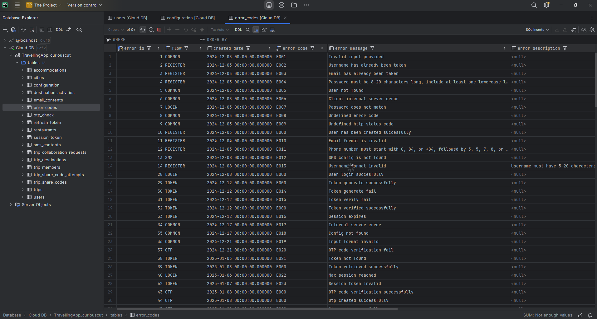

# Backend Architecture

WanderMate backend follows a layered Spring Boot structure.

## Main layers

```text
Controller interface
  ↓
Controller implementation
  ↓
Service interface
  ↓
Service implementation
  ↓
Repository
  ↓
Entity / Database
```

## Package responsibilities

| Package | Responsibility |
|---|---|
| `controller` | Public API contracts and request mappings |
| `controller.impl` | Controller implementations that call services |
| `service` | Service interfaces |
| `service.impl` | Business logic and transaction-like orchestration |
| `repository` | Spring Data JPA database access |
| `entity` | JPA entities |
| `dto.request` | Incoming request payloads |
| `dto.response` | Outgoing response payloads |
| `validator` | Input validation and business validation helpers |
| `mapper` | Entity/DTO mapping |
| `security` | token filter, authenticated user provider, password hashing |
| `config` | Cloudinary, mail, OpenAPI, security config |
| `response_template` | Consistent response wrapper |
| `exception_handler` | Business exception and global exception handling |

## Core design choices

### Interfaces + implementations

Controllers and services are split into interfaces and implementation classes. This makes the public contract clear and keeps implementation logic separate.

### Response wrapper

Responses use `CompleteResponse` / `ResponseBody` so frontend receives a consistent shape with error code, message, flow and body.

### Business exceptions

Business failures throw `BusinessException` with an `ErrorCodeEnum` and flow. `GlobalExceptionHandler` turns those exceptions into structured API responses.

### Authentication filter

`TokenFilter` validates Bearer access tokens, reads the session context where needed, and loads the authenticated user into Spring Security context.

### Data access

Repositories use Spring Data JPA and custom query methods for collaboration lookups, trip ownership/member access and nested content.

## Key modules

| Module | Notes |
|---|---|
| User/Auth | Registration, login, forgot password, profile/settings, logout |
| OTP | Send, verify, cooldown, retry, block/restriction, consume-on-success |
| Token | Access token, refresh token, session token, revocation |
| Trips | Trip CRUD, status, search/suggestions |
| Destinations | Nested under trip |
| Activities | Nested under destination |
| Collaboration | Invitations, join requests, share codes, members, summary |
| Uploads | Cloudinary image upload and image metadata |

## Screenshot proof


