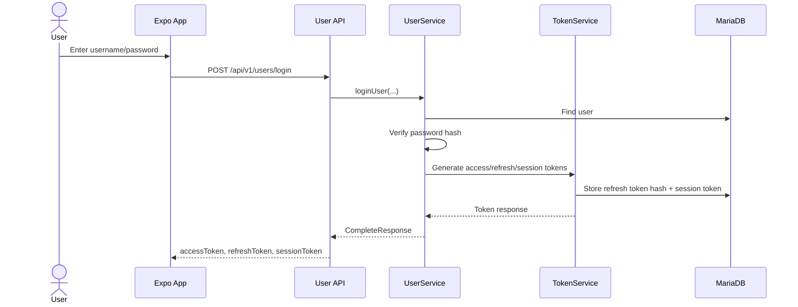
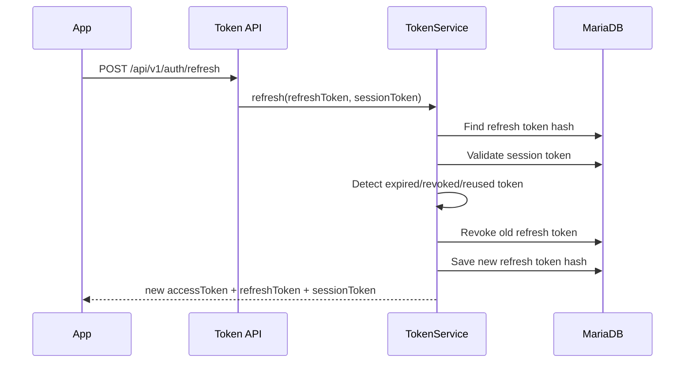

# Authentication and OTP Flow

This document explains the authentication design in WanderMate.

## Token Model

The backend uses three values after login:

| Token | Purpose | Database Storage |
|---|---|---|
| `accessToken` | JWT for protected APIs | Not stored as raw token |
| `refreshToken` | Used to rotate tokens | Hashed in `refresh_token` |
| `sessionToken` | Validates active login session/device | Encoded/hashed in `session_token` |

Protected calls require:

```http
Authorization: Bearer <accessToken>
Session-Token: <sessionToken>
```

Refresh calls require:

```http
Refresh-Token: <refreshToken>
Session-Token: <sessionToken>
```

## Login Flow



The frontend stores tokens using Expo SecureStore.

## Max Session Flow

`MAX_ALLOWED_SESSIONS` is configured in the `configuration` table.

If a user reaches the max session count:

```text
1. Backend returns MAX_SESSIONS_REACHED.
2. Frontend shows confirmation.
3. If user continues, frontend retries login with overrideMaxSession=true.
4. Backend revokes the oldest session and creates a new one.
```

Example retry request:

```json
{
  "username": "owner_user",
  "password": "Password123!",
  "overrideMaxSession": true
}
```

## Access Token Validation

For protected APIs:

```text
1. TokenFilter checks whether the route is public.
2. It reads Authorization Bearer access token.
3. It validates JWT signature and expiry.
4. It validates Session-Token against active session data.
5. It loads user identity into Spring SecurityContext.
6. Controller/service layer continues as authenticated user.
```

## Refresh Flow



Refresh-token reuse is treated as suspicious. Reused or invalid refresh tokens are rejected.

## Logout Flow

```text
1. Frontend calls POST /api/v1/users/logout.
2. Backend reads current session token and username.
3. Backend revokes the current session/refresh token chain.
4. Frontend clears SecureStore tokens.
5. Frontend resets auth state and theme preference to SYSTEM.
```

## OTP Flow

OTP is used for registration and forgot-password flows.

High-level send flow:

```text
1. User submits username/email/phone depending on flow.
2. Backend validates the user details.
3. Backend checks retry/restriction limits.
4. Backend generates OTP.
5. Backend sends email/SMS depending on verification method.
6. Backend stores newest OTP and expiry metadata.
```

High-level verify flow:

```text
1. User enters OTP.
2. Backend checks OTP record.
3. Backend checks block/retry/expiry state.
4. Backend checks OTP value.
5. On success, OTP is consumed/accepted for the target flow.
```

Important OTP configuration keys:

```text
OTP_EXPIRATION_TIME
OTP_RESTRICTED_TIME
MAX_RETRY_SEND_OTP
MAX_RETRY_VERIFY_OTP
EMAIL_OAUTH_REFRESH_ENABLED
```

## Frontend Theme Hydration

User theme preference is stored in the backend profile.

The frontend should apply saved theme after:

```text
- login success
- session restore/app boot
- profile/settings update
```

This avoids requiring the user to open the Profile screen before dark/light mode is applied.

## Security Notes

Do not commit:

```text
JWT secret
Google OAuth client secret
Google OAuth refresh token
raw database dumps
refresh token rows
session token rows
backend/.env
```

For public GitHub, use `.env.example` and safe placeholder seed data only.
