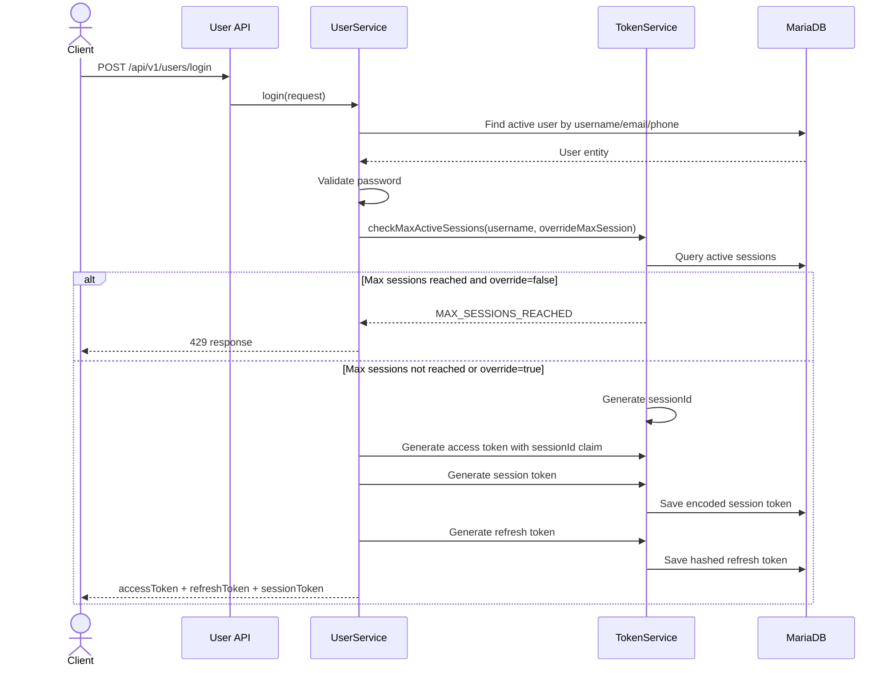
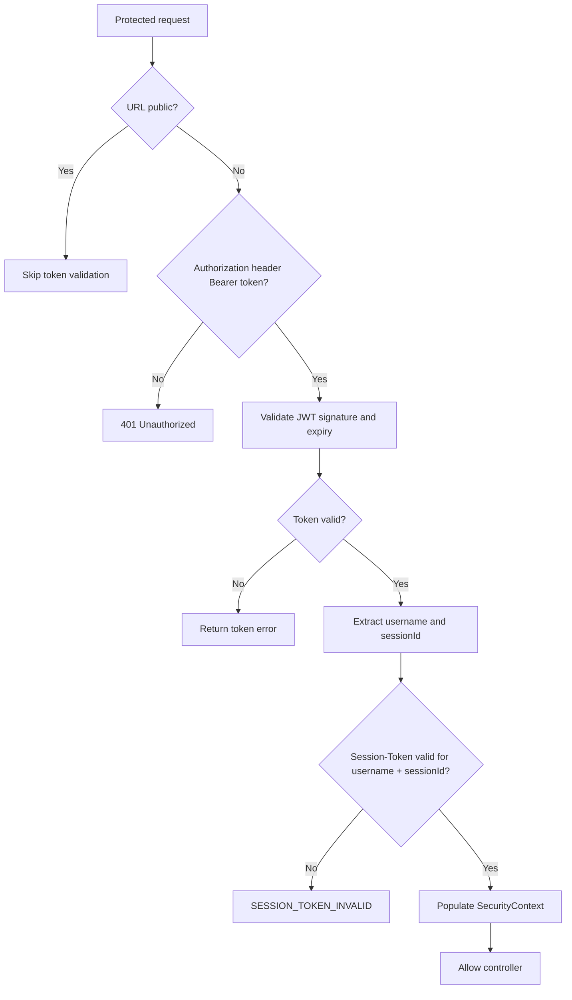
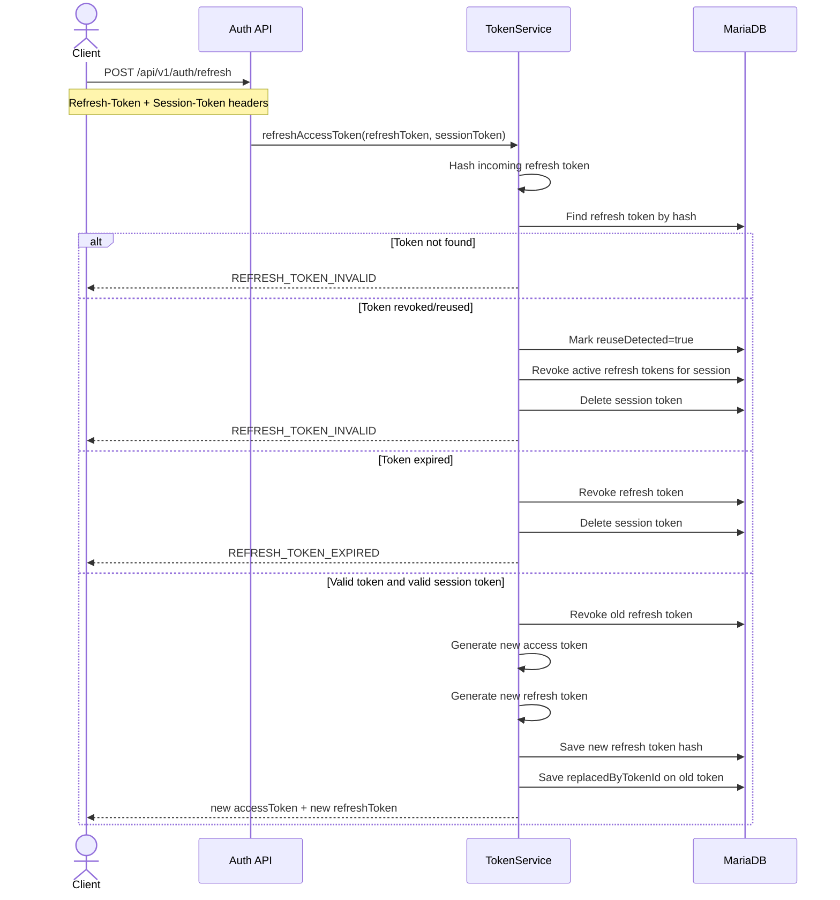

# Authentication and OTP Flow

This document explains authentication, sessions, refresh tokens, logout, and OTP behaviour in the WanderMate / Travelling App backend.

---

## Core Token Model

The backend uses three token values after login:

```text
accessToken
refreshToken
sessionToken
```

| Token | Purpose | Storage |
|---|---|---|
| `accessToken` | JWT used for protected API authorization | Returned to client; not stored as raw value in DB |
| `refreshToken` | Used to rotate access tokens | Raw token returned to client; hashed token stored in DB |
| `sessionToken` | Validates the active login session | Raw token returned to client; encoded token stored in DB |

Protected requests require:

```text
Authorization: Bearer <accessToken>
Session-Token: <sessionToken>
```

Refresh requests require:

```text
Refresh-Token: <refreshToken>
Session-Token: <sessionToken>
```

---

## Login Flow



Login request:

```json
{
  "username": "JustinBo123",
  "password": "Password123",
  "overrideMaxSession": false
}
```

Response body:

```json
{
  "accessToken": "...",
  "refreshToken": "...",
  "sessionToken": "..."
}
```

---

## Max Active Session Flow

The max active sessions value is read from configuration:

```text
MAX_ALLOWED_SESSIONS
```

Default behaviour:

```text
If active sessions < max → login allowed
If active sessions >= max and overrideMaxSession=false → MAX_SESSIONS_REACHED
If active sessions >= max and overrideMaxSession=true → revoke oldest session(s), then login allowed
```

Frontend expected behaviour:

```text
1. Login returns MAX_SESSIONS_REACHED
2. Frontend shows confirmation popup
3. User agrees to terminate oldest session
4. Frontend retries login with overrideMaxSession=true
```

---

## Access Token Validation Flow



The access token contains:

```text
subject = username
sessionId = active session id
roles = user authorities
```

---

## Refresh Token Rotation Flow



Refresh request:

```http
POST /api/v1/auth/refresh
Refresh-Token: <refreshToken>
Session-Token: <sessionToken>
```

The refresh token is rotated on every successful refresh.

---

## Logout Flow

Logout is protected and needs:

```text
Authorization: Bearer <accessToken>
Session-Token: <sessionToken>
```

Flow:

```text
1. TokenFilter validates access token and session token
2. UserService gets authenticated username + sessionId
3. Backend deletes the matching session token
4. Backend revokes active refresh tokens for that sessionId
5. Client clears local tokens
```

---

## Register with Email OTP

Recommended current real flow:

```text
1. User enters username, password, email, optional phone, dob
2. Frontend calls /api/v1/users/register/verify
3. Backend validates duplicate username/email/phone and request format
4. Frontend calls /api/v1/otp/send with EMAIL_OTP
5. Backend sends email OTP when email config is correctly set
6. User enters OTP
7. Frontend calls /api/v1/users/register with OTP
8. Backend verifies OTP and creates user
```

Send OTP request:

```json
{
  "userName": "JustinBo123",
  "otpVerificationMethod": "EMAIL_OTP",
  "email": "justin@example.com",
  "emailEnum": "EMAIL_OTP_REGISTER"
}
```

Register request:

```json
{
  "username": "JustinBo123",
  "password": "Password123",
  "email": "justin@example.com",
  "phoneNumber": "0412345678",
  "dob": "01/01/2000",
  "otp": "123456"
}
```

---

## Forgot Password with OTP

Flow:

```text
1. User requests OTP using registered email or phone
2. Backend validates the OTP destination belongs to the existing user
3. User submits new password + OTP
4. Backend verifies OTP
5. Backend updates encoded password
```

Request:

```json
{
  "username": "JustinBo123",
  "newPassword": "NewPassword123",
  "email": "justin@example.com",
  "otp": "123456"
}
```

---

## OTP Retry and Blocking Rules

The backend tracks separate retry counters:

```text
retrySendOtpCount
retryVerifyOtpCount
```

Configuration keys:

```text
MAX_RETRY_SEND_OTP
MAX_RETRY_VERIFY_OTP
OTP_RESTRICTED_TIME
OTP_EXPIRATION_TIME
```

Behaviour:

```text
Too many send attempts → OTP record blocked temporarily
Too many wrong/expired verification attempts → OTP record blocked temporarily
Restriction expired → counters reset and OTP can be requested again
New OTP send → verification retry count resets
```

---

## Email vs SMS OTP Status

Email OTP:

```text
Implemented end-to-end when Gmail/OAuth/email configuration is correctly set.
```

SMS OTP:

```text
Prepared at service level and unit-tested with mocks.
Real SMS provider integration is not enabled yet.
```

The current `SmsServiceImpl` returns `SMS_SENT_SUCCESS` without calling an external SMS provider. Do not describe phone OTP as real delivery until a provider is integrated.

---

## Security Notes

- Passwords are encoded before storage.
- Refresh tokens are hashed before storage.
- Session tokens are encoded before storage.
- Access token includes session id, so a stolen access token alone is not enough if the session token is missing/invalid.
- Refresh token reuse triggers session revocation.
- Public/private routes are configured from the database-backed configuration table.

## Protected Profile and Settings Flow

The current profile/settings endpoints are protected and use the same auth headers as trip APIs.

```text
GET   /api/v1/users/me
PATCH /api/v1/users/me/profile
PATCH /api/v1/users/me/settings
```

Required headers:

```text
Authorization: Bearer <accessToken>
Session-Token: <sessionToken>
```

Profile/settings update non-sensitive user-facing fields such as display name, profile image URL, and preferred theme. Password reset still goes through the forgot-password OTP flow.
