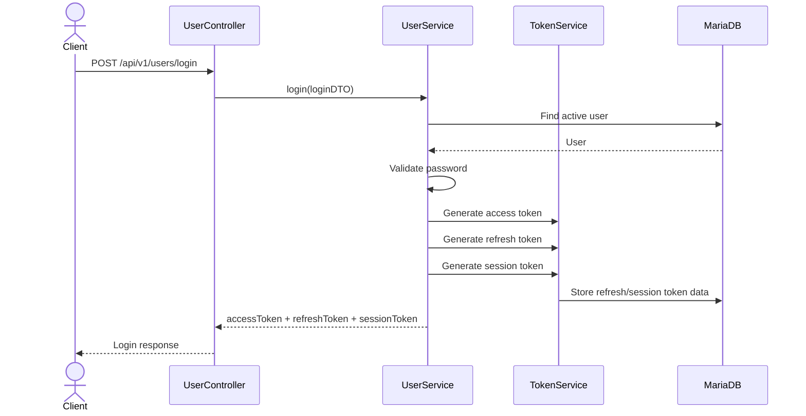
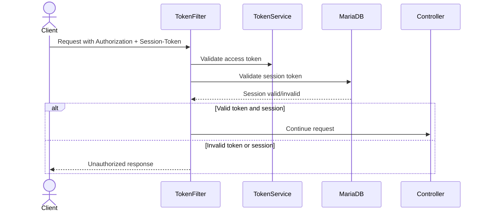
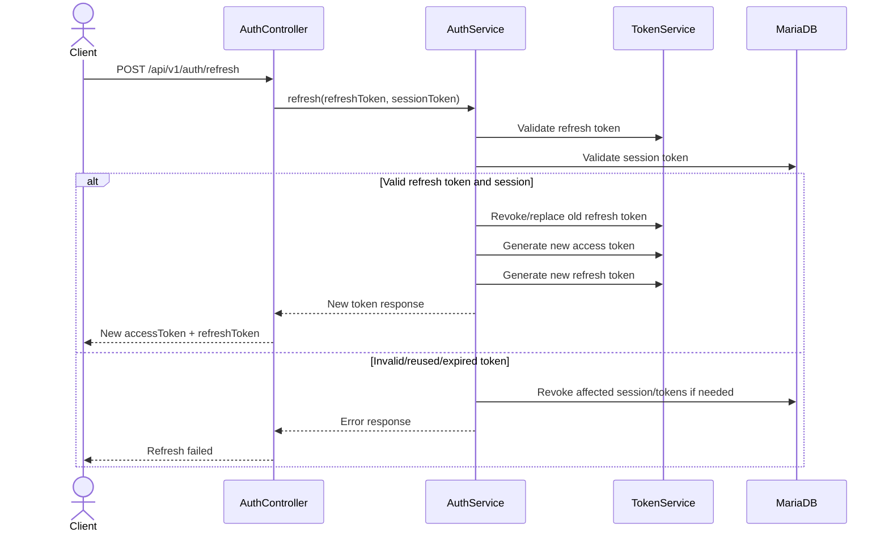
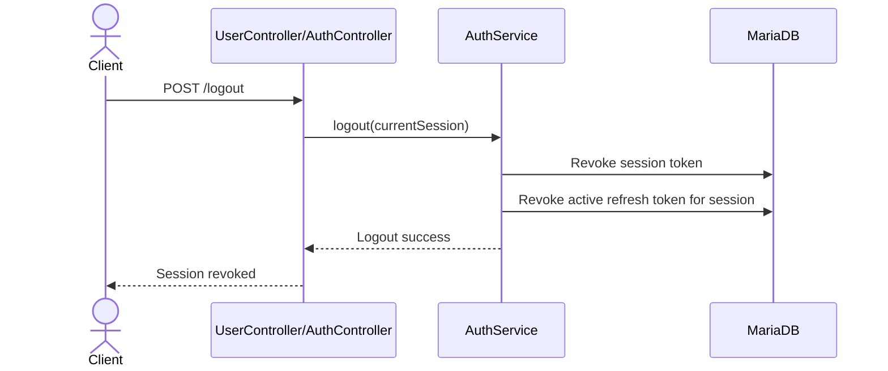

# Authentication and Token Flow

This document explains how authentication, access tokens, refresh tokens, sessions, and logout work in the backend.

---

## Main Concepts

| Concept | Purpose |
|---|---|
| Access token | Short-lived JWT used to access protected APIs |
| Refresh token | Longer-lived token used to request a new access token |
| Session token | Represents a login session and supports session validation/revocation |
| Token filter | Checks incoming protected requests before they reach controllers |
| Logout | Revokes session and active refresh tokens so the user cannot continue using that session |

---

## Login Response

A successful login returns:

```text
accessToken
refreshToken
sessionToken
```

Protected requests require:

```text
Authorization: Bearer <accessToken>
Session-Token: <sessionToken>
```

The refresh endpoint requires:

```text
Refresh-Token: <refreshToken>
Session-Token: <sessionToken>
```

---

## Login Flow



---

## Protected Request Flow



---

## Refresh Token Flow

The refresh endpoint is public from the access-token filter perspective, but it still requires refresh/session headers.

Required headers:

```text
Refresh-Token: <refreshToken>
Session-Token: <sessionToken>
```

Flow:



---

## Logout Flow

Protected logout requests require:

```text
Authorization: Bearer <accessToken>
Session-Token: <sessionToken>
```

Flow:



After logout, the user cannot keep using the same session token or refresh token.

---

## Why Access Token + Session Token?

The access token proves the identity of the user.

The session token proves the login session is still active and not revoked.

This gives the backend more control than a JWT-only setup because logout and session revocation can be enforced through the database.

---

## Security Notes

- Access tokens should be short-lived.
- Refresh tokens should be treated as sensitive.
- Session tokens should be revoked on logout.
- Refresh token reuse should be treated as suspicious.
- Stored refresh/session tokens should be hashed if possible.
- Real token values should never be logged.
- Real secrets must be stored in `.env` or cloud secret storage, not in Git.

---

## Public vs Protected Routes

Public routes include:

```text
POST /api/v1/users/register
POST /api/v1/users/login
POST /api/v1/auth/refresh
POST /api/v1/otp/send
POST /api/v1/otp/verify
GET  /swagger-ui/**
GET  /v3/api-docs/**
```

Protected routes include user-specific resources such as:

```text
/api/v1/trips/**
/api/v1/trips/{tripId}/destinations/**
/api/v1/trips/{tripId}/destinations/{destinationId}/activities/**
```

---

## Interview Explanation

A clear way to explain this project in an interview:

```text
The backend uses short-lived JWT access tokens for protected API requests, but it also requires a session token for session validation. When the access token expires, the client can use a refresh token with the session token to request a new access token. Refresh tokens and session tokens are stored in the database so they can be revoked during logout or replaced during refresh.
```
