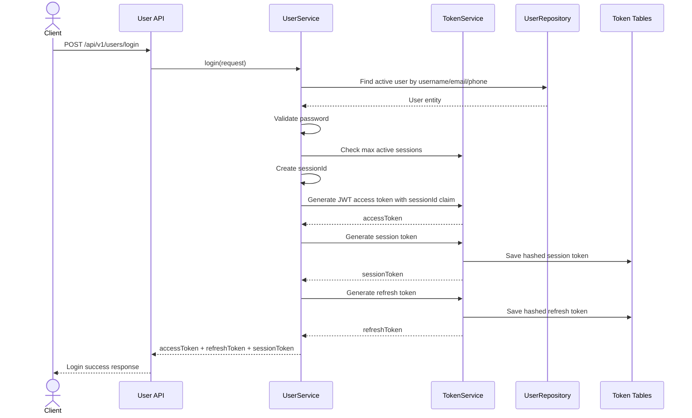
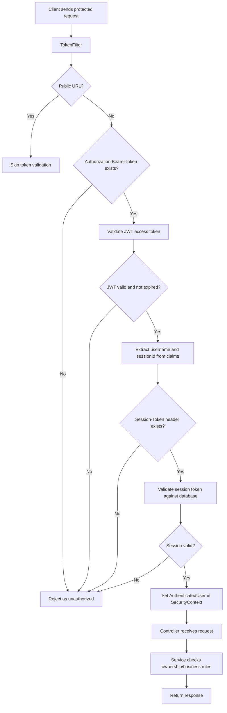
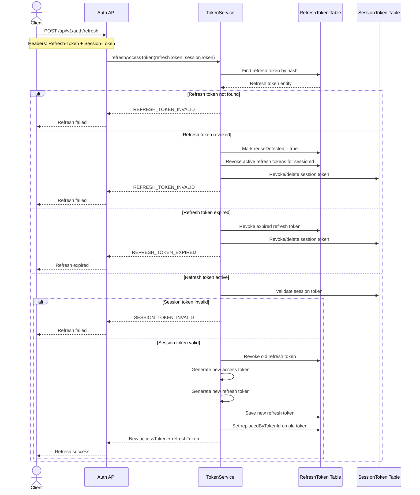
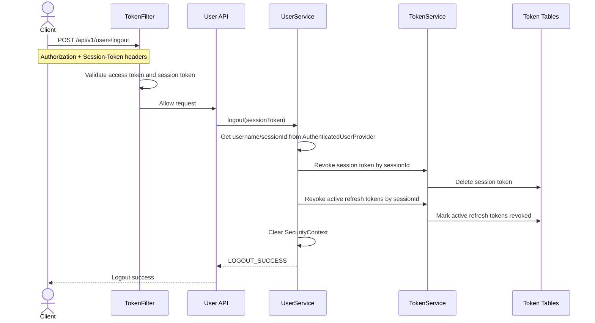

# Authentication and Token Flow

This document explains how authentication, access tokens, refresh tokens, sessions, and logout work in the backend.

---

## Main Concepts

| Concept | Purpose |
|---|---|
| Access token | Short-lived JWT used to access protected APIs |
| Refresh token | Longer-lived token used to request a new access token |
| Session token | Represents a login session and supports session validation/revocation |
| Token filter | Checks incoming protected requests before they reach controllers |
| Logout | Revokes session and active refresh tokens so the user cannot continue using that session |

---

## Login Response

A successful login returns:

```text
accessToken
refreshToken
sessionToken
```

Protected requests require:

```text
Authorization: Bearer <accessToken>
Session-Token: <sessionToken>
```

The refresh endpoint requires:

```text
Refresh-Token: <refreshToken>
Session-Token: <sessionToken>
```

---

## Login Flow



---

## Protected Request Flow



---

## Refresh Token Flow



---

## Logout Flow

Logout is a protected API, so the request must first pass the token filter.



---

## Why Refresh Token Revocation Matters

Refresh token revocation helps protect the system if a token is stolen or if the user logs out.

Important behaviours:

- Expired refresh tokens cannot be used.
- Revoked refresh tokens cannot be used.
- Reuse of a revoked refresh token is detected.
- Old refresh tokens are replaced when a new refresh token is issued.
- Logout prevents future refresh from the same session.

---

## Interview Explanation

A clear way to explain this project in an interview:

```text
The backend uses short-lived JWT access tokens for protected API requests, but it also requires a session token for session validation. When the access token expires, the client can use a refresh token with the session token to request a new access token. Refresh tokens and session tokens are stored as hashes in the database so they can be revoked during logout or replaced during refresh.
```
