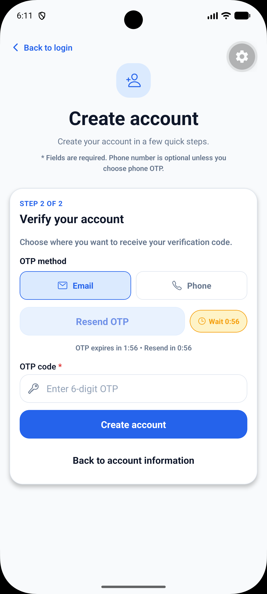
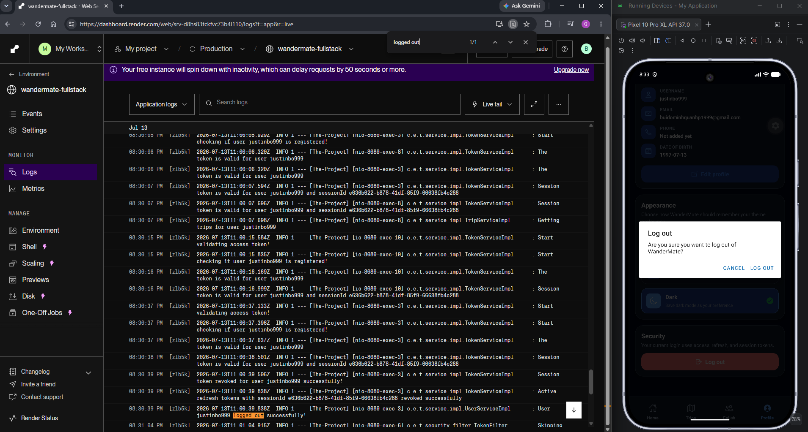

# Authentication, OTP and Session Flow

WanderMate uses a custom authentication flow built around password hashing, OTP verification, JWT access tokens, refresh tokens and session tokens.

## Main concepts

| Concept | Purpose |
|---|---|
| Password hash | Stores password securely instead of plain text |
| OTP | Verifies registration and forgot-password flows |
| Access token | Short-lived Bearer token for protected APIs |
| Refresh token | Used to obtain a new access token |
| Session token | Tracks active login session and supports logout/revocation |

## Register flow

1. User enters username, email, phone and password.
2. Backend checks active user uniqueness.
3. User requests OTP.
4. Backend validates destination, retry, block and cooldown rules.
5. Backend sends OTP.
6. User verifies OTP.
7. Backend consumes/deletes verified OTP record.
8. User completes registration.

Screenshot:

## OTP resend flow

1. Existing OTP row is found by username, email or phone depending on request.
2. If blocked and restriction has not expired, request fails.
3. If blocked but restriction expired, retry state resets.
4. If send retry limit is reached, row becomes blocked.
5. If cooldown has not expired, request fails with cooldown error.
6. If checks pass, a new OTP is sent and saved.

The frontend shows a resend timer so users cannot spam OTP requests.

## Login flow

1. User submits username/password.
2. Backend validates credentials.
3. Backend issues access token, refresh token and session token.
4. Frontend stores tokens securely.
5. Frontend sends access token in `Authorization: Bearer` header.

Screenshot:

## Refresh flow

1. Frontend calls `/api/v1/auth/refresh`.
2. Request includes refresh token and session token.
3. Backend validates the session and refresh token.
4. Backend returns a fresh access token and refresh token.

## Logout flow

1. Frontend calls logout with access token and session token.
2. Backend revokes the current session.
3. Frontend clears stored tokens.
4. Revoked session cannot refresh or continue authenticated requests.

Screenshot:

## Session limit proof

## Security notes

- Do not store real tokens in docs or screenshots.
- Do not export Postman environments after login unless tokens are cleared.
- Consider hashing OTP values in a future production hardening step.
- Consider explicit OTP purpose values such as `REGISTER`, `FORGOT_PASSWORD`, `CHANGE_EMAIL` in a future version.
