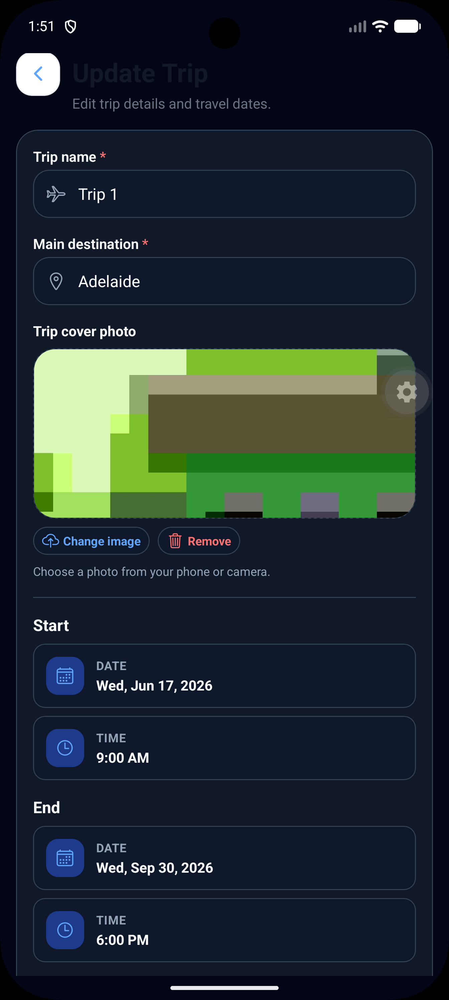
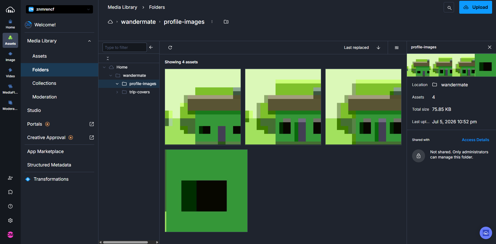

# Cloudinary Image Storage

WanderMate uses Cloudinary for uploaded user avatars and trip cover images.

## Upload endpoint

```http
POST /api/v1/uploads/images
Content-Type: multipart/form-data
Authorization: Bearer <accessToken>
```

Form-data fields:

```text
file: image file
imagePurpose: PROFILE_AVATAR or TRIP_COVER
```

## Response data

The upload response includes the public image URL and Cloudinary public ID. The frontend stores/uses the image URL for rendering. The backend stores public IDs where needed so older Cloudinary images can be deleted or replaced safely.

## Image purposes

| Purpose | Used by |
|---|---|
| `PROFILE_AVATAR` | User profile avatar upload |
| `TRIP_COVER` | Trip cover image upload |

## Screenshots

### Trip cover upload



### Profile avatar upload


### Cloudinary proof



## Environment variables

```text
CLOUDINARY_CLOUD_NAME
CLOUDINARY_API_KEY
CLOUDINARY_API_SECRET
CLOUDINARY_BASE_FOLDER
```

Do not commit real Cloudinary secrets.

## Future hardening

- Enforce stricter file type validation.
- Add image dimension/size checks if needed.
- Add upload audit logging.
- Consider folder separation for profile/trip images.
