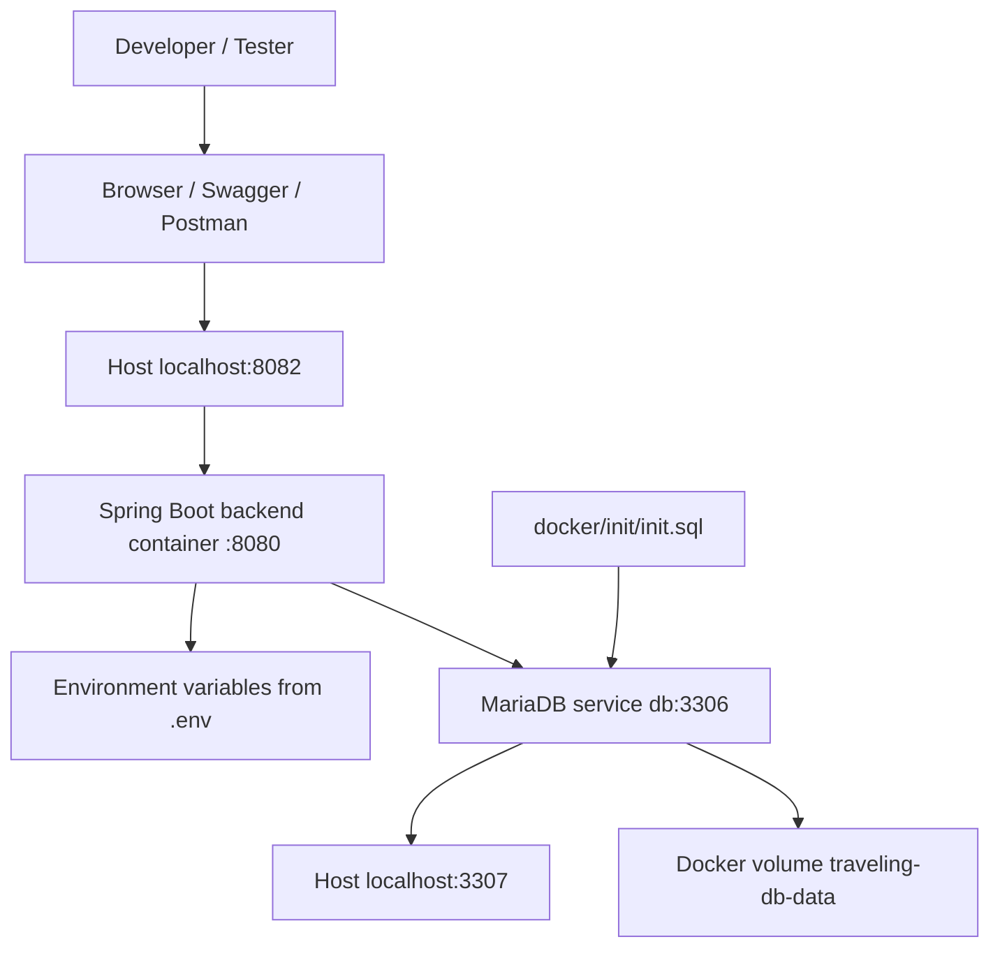

# Docker Setup

This document explains how to run the WanderMate / Travelling App backend using Docker Compose.

---

## Purpose

Docker is used for:

- Running the backend without manually installing Java/Maven locally
- Running a local MariaDB database for demo/testing
- Creating a consistent environment across machines
- Making the project easier to present on GitHub and in interviews

---

## Docker Architecture



---

## Files Involved

Backend folder should contain:

```text
Dockerfile
docker-compose.yml
.env.example
.env                 # local only, ignored by Git
docker/init/init.sql
```

`.env.example` is safe to commit. `.env` is private and must not be committed.

---

## Port Mapping

| Service | Host Port | Container Port |
|---|---:|---:|
| Backend | 8082 | 8080 |
| MariaDB | 3307 | 3306 |

This means:

```text
http://localhost:8082 → backend container port 8080
localhost:3307         → MariaDB container port 3306
```

Expo Metro commonly uses `8081`, so the Docker backend uses `8082`.

---

## Environment Variables

Copy `.env.example` to `.env`:

```bash
cp .env.example .env
```

Windows PowerShell:

```powershell
copy .env.example .env
```

Example `.env`:

```env
DB_NAME=traveling_app
DB_HOST_PORT=3307
DB_USERNAME=traveling_user
DB_PASSWORD=traveling_password
DB_ROOT_PASSWORD=root_password

BACKEND_HOST_PORT=8082
DB_URL=jdbc:mariadb://db:3306/traveling_app
SPRING_JPA_HIBERNATE_DDL_AUTO=update

EMAIL_OAUTH_REFRESH_ENABLED=false
EMAIL_CLIENT_ID=replace_me
EMAIL_CLIENT_SECRET=replace_me
EMAIL_REFRESH_TOKEN=replace_me
EMAIL_TOKEN_URL=https://oauth2.googleapis.com/token
EMAIL_ADDRESS_CONFIG=demo@example.com
```

Important:

```text
Inside backend container: use db:3306
From host machine:       use localhost:3307
```

Do not use `localhost:3307` inside Docker backend. `localhost` inside a container means the container itself.

---

## Run Docker

Start Docker Desktop first, then run from the backend folder:

```bash
docker compose up --build
```

Open Swagger:

```text
http://localhost:8082/The-Project/swagger-ui/index.html
```

Backend base URL:

```text
http://localhost:8082/The-Project
```

---

## Check Status

```bash
docker compose ps
```

Expected:

```text
traveling-app-db        healthy
traveling-app-backend   running
```

Check logs:

```bash
docker logs traveling-app-backend
```

```bash
docker logs traveling-app-db
```

Inspect resolved Compose config:

```bash
docker compose config
```

This should show real values, not unresolved placeholders like `${DB_URL}`.

---

## Stop Docker

Stop containers while keeping database data:

```bash
docker compose down
```

Reset database volume and re-import SQL seed:

```bash
docker compose down -v
docker compose up --build
```

Use `down -v` carefully because it deletes the MariaDB Docker volume.

---

## Rebuild Rules

Use normal restart when you only want to start existing containers:

```bash
docker compose up
```

Use build when Java code, `pom.xml`, or Dockerfile changed:

```bash
docker compose up --build
```

Use force recreate after changing `.env`:

```bash
docker compose up --build --force-recreate
```

---

## Common Issues

### Docker daemon is not running

Error example:

```text
failed to connect to the docker API at npipe:////./pipe/dockerDesktopLinuxEngine
```

Fix:

```text
1. Open Docker Desktop
2. Wait until Docker says it is running
3. Run docker version and confirm both Client and Server appear
4. Retry docker compose up --build
```

### Driver claims to not accept jdbcUrl `${DB_URL}`

Error example:

```text
Driver org.mariadb.jdbc.Driver claims to not accept jdbcUrl, ${DB_URL}
```

This means Spring received the literal unresolved placeholder `${DB_URL}`.

Fix:

```bash
docker compose config
```

Check that `DB_URL` resolves to:

```text
jdbc:mariadb://db:3306/traveling_app
```

Also check that `.env` exists in the backend folder.

### Backend cannot connect to database

Inside Docker, use:

```env
DB_URL=jdbc:mariadb://db:3306/traveling_app
```

Do not use this inside Docker:

```env
DB_URL=jdbc:mariadb://localhost:3307/traveling_app
```

### Database seed does not import

MariaDB only imports SQL files from `/docker-entrypoint-initdb.d` when the DB volume is empty.

Fix:

```bash
docker compose down -v
docker compose up --build
```

### Port already in use

If host port `8082` is used, change this in `.env`:

```env
BACKEND_HOST_PORT=8083
```

Then run:

```bash
docker compose up --build --force-recreate
```

### Email OTP fails in public Docker demo

This is expected if email secrets/OAuth values are placeholders.

Public/demo `.env` can keep:

```env
EMAIL_OAUTH_REFRESH_ENABLED=false
```

Private testing should use real email/OAuth values in `.env` only.

### SMS OTP does not send real SMS

This is expected. Phone/SMS OTP is prepared at service level and tested with mocks, but no real SMS provider is enabled.

---

## Frontend Connection Notes

Android emulator to local IntelliJ backend:

```text
http://10.0.2.2:8080/The-Project
```

Android emulator to Docker backend:

```text
http://10.0.2.2:8082/The-Project
```

Browser/Postman to Docker backend:

```text
http://localhost:8082/The-Project
```

---

## Production Note

For production/cloud deployment:

- Do not use local Docker DB credentials.
- Provide environment variables through the cloud platform.
- Consider setting `spring.jpa.hibernate.ddl-auto=validate` or migration tooling later.
- Restrict or disable Swagger UI in production.
- Store all secrets outside Git.

## V3 Frontend Testing Notes

For V3 frontend collaboration testing, use at least two accounts:

```text
Account A: creates trip and acts as OWNER
Account B: accepts invitation or requests to join as EDITOR/VIEWER
```

Android emulator URLs:

```text
Local IntelliJ backend: http://10.0.2.2:8080/The-Project
Docker backend:         http://10.0.2.2:8082/The-Project
Production backend:     https://wandermate-fullstack.onrender.com/The-Project
```

After changing frontend `.env`, restart Expo:

```bash
npx expo start --clear
```
