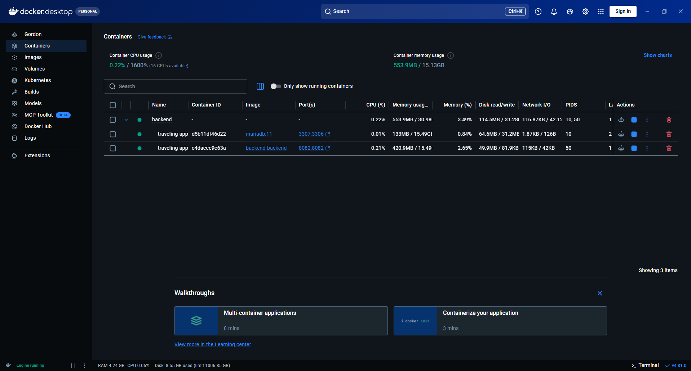

# Docker Setup

Docker support is mainly for local backend + MariaDB testing.

## Files

```text
backend/Dockerfile
backend/docker-compose.yml
backend/docker/init/init.sql
```

## Run

```bash
cd backend
docker compose up --build
```

The default `.env.example` maps host port `8082` to the application's container port `8080`.
With that default, the Docker health endpoint is:

```text
http://localhost:8082/The-Project/api/v1/health
```

## Stop

```bash
docker compose down
```

## Fresh reset

```bash
docker compose down -v
docker compose up --build
```

## Required environment values

Keep these in a local `.env` file only:

```text
DB_URL
DB_USERNAME
DB_PASSWORD
DB_NAME
DB_ROOT_PASSWORD
DB_HOST_PORT
BACKEND_HOST_PORT
JWT_SECRET
REFRESH_TOKEN_HASH_SECRET
CLOUDINARY_CLOUD_NAME
CLOUDINARY_API_KEY
CLOUDINARY_API_SECRET
CLOUDINARY_BASE_FOLDER
EMAIL_OAUTH_REFRESH_ENABLED
EMAIL_CLIENT_ID
EMAIL_CLIENT_SECRET
EMAIL_REFRESH_TOKEN
EMAIL_TOKEN_URL
EMAIL_ADDRESS_CONFIG
```

Do not commit real `.env` values.

Generate independent secrets, for example:

```bash
openssl rand -base64 64
openssl rand -base64 32
```

Put the first value in `JWT_SECRET` and the second in
`REFRESH_TOKEN_HASH_SECRET`. Compose passes both the direct environment names
and Spring's explicit `APP_SECURITY_*` property names into the backend
container. Rotating either secret invalidates the associated active tokens;
changing the refresh-token HMAC secret requires users to sign in again.

The container listens on port `8080`. The default Compose mapping exposes it
on host port `8082`, so the Docker health URL is:

```text
http://localhost:8082/Wandermate/api/v1/health
```

## Proof


