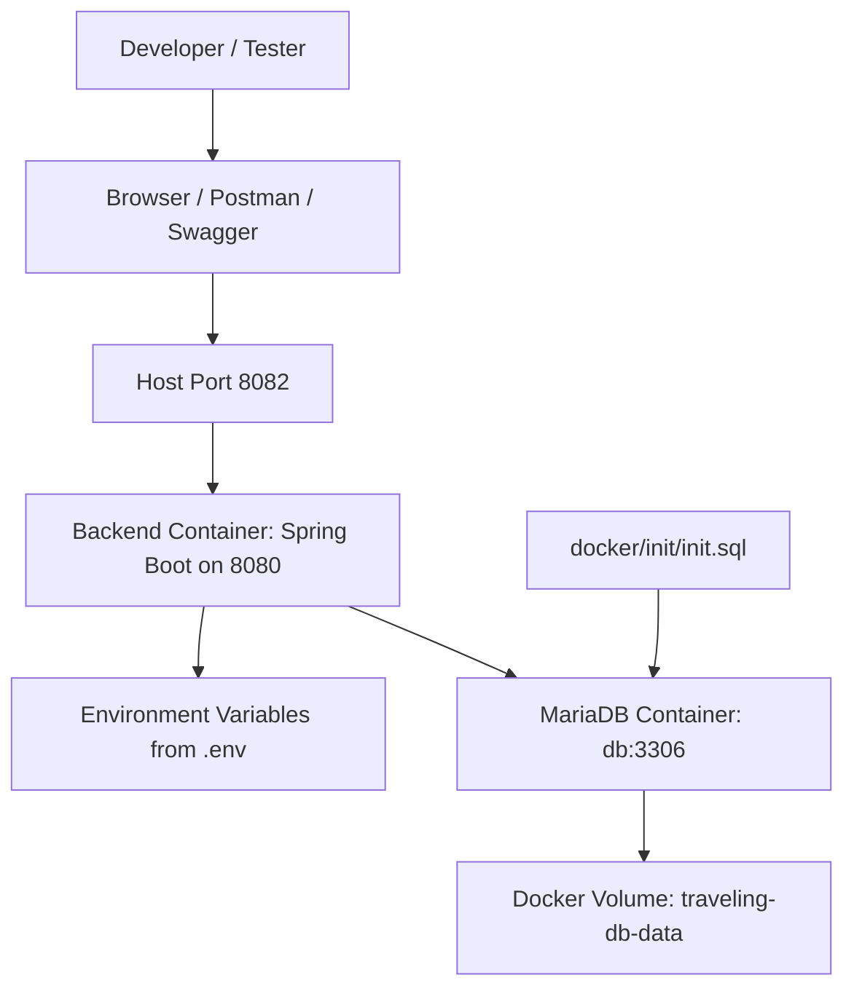

# Docker Setup

This document explains how to run the WanderMate / Travelling App backend using Docker.

---

## Purpose of Docker in This Project

Docker is used for:

- Running the backend without installing Java/Maven locally
- Running a local MariaDB database for demo/testing
- Creating a consistent environment across machines
- Preparing the backend for future cloud deployment

---

## Docker Architecture



---

## Local Port Mapping

| Service | Host Port | Container Port |
|---|---:|---:|
| Backend | 8082 | 8080 |
| MariaDB | 3307 | 3306 |

This means:

```text
http://localhost:8082 → backend container port 8080
localhost:3307         → MariaDB container port 3306
```

Expo Metro uses `localhost:8081` during frontend development, so Docker backend should not use host port `8081`.

---

## Required Files

Backend folder should include:

```text
Dockerfile
docker-compose.yml
.env.example
.env
docker/init/init.sql
```

`.env` is private and should not be committed.

`.env.example` is safe and should be committed.

---

## Create `.env`

Copy `.env.example` and rename it to `.env`.

Example local Docker demo values:

```env
DB_USERNAME=traveling_user
DB_PASSWORD=traveling_password
DB_ROOT_PASSWORD=root_password

SPRING_DATASOURCE_URL=jdbc:mariadb://db:3306/traveling_app
SPRING_DATASOURCE_USERNAME=traveling_user
SPRING_DATASOURCE_PASSWORD=traveling_password
SPRING_JPA_HIBERNATE_DDL_AUTO=update

EMAIL_OAUTH_REFRESH_ENABLED=false
EMAIL_CLIENT_ID=replace_me
EMAIL_CLIENT_SECRET=replace_me
EMAIL_REFRESH_TOKEN=replace_me
EMAIL_TOKEN_URL=https://oauth2.googleapis.com/token
EMAIL_ADDRESS_CONFIG=demo@example.com
```

Important:

```text
Inside Docker: use db:3306
From host machine: use localhost:3307
```

For private local testing, real OAuth/email values can be placed in `.env`.

---

## Run Docker

Start Docker Desktop first, then run from the backend folder:

```bash
docker compose up --build
```

Open Swagger:

```text
http://localhost:8082/The-Project/swagger-ui/index.html
```

If there is no application context path later, use:

```text
http://localhost:8082/swagger-ui/index.html
```

---

## Stop Docker

Stop containers while keeping database data:

```bash
docker compose down
```

Reset database volume and re-import `init.sql`:

```bash
docker compose down -v
docker compose up --build
```

Use `down -v` carefully because it deletes the Docker database volume.

---

## Local Docker DB vs Cloud DB

This project supports two database modes:

```text
Docker demo DB
→ MariaDB container
→ seeded by docker/init/init.sql

Cloud DB
→ external hosted database
→ used for private testing or production
```

For production deployment, the backend container can connect to a cloud database using environment variables.

---

## Common Docker Commands

Check running containers:

```bash
docker ps
```

Check backend logs:

```bash
docker logs traveling-app-backend
```

Check DB logs:

```bash
docker logs traveling-app-db
```

Check environment variables inside backend container:

```bash
docker exec traveling-app-backend sh -c "printenv | grep EMAIL"
```

Rebuild after Java code changes:

```bash
docker compose up --build
```

Force recreate containers after `.env` changes:

```bash
docker compose up --build --force-recreate
```

---

## Common Issues

### Port already in use

If `8080` is already used by IntelliJ local run, map Docker backend to host port `8082`:

```yaml
ports:
  - "8082:8080"
```

Avoid host port `8081` because Expo Metro commonly uses it.

### Backend cannot connect to database

Inside Docker, the datasource URL should use:

```env
SPRING_DATASOURCE_URL=jdbc:mariadb://db:3306/traveling_app
```

Do not use this inside Docker:

```env
SPRING_DATASOURCE_URL=jdbc:mariadb://localhost:3307/traveling_app
```

`localhost` inside the backend container means the backend container itself, not the database container.

### `init.sql` does not import

MariaDB only imports SQL files from `/docker-entrypoint-initdb.d` when the database volume is empty.

Run:

```bash
docker compose down -v
docker compose up --build
```

### Email OTP fails in public Docker demo

This is expected if OAuth/email secrets are disabled or replaced with placeholders.

For public GitHub demo:

```env
EMAIL_OAUTH_REFRESH_ENABLED=false
```

For private testing, provide real email/OAuth values in `.env`.

---

## Production Note

In production, the mobile app should not call `localhost`.

The frontend should call a public backend API URL such as:

```text
https://api.wandermate.com
```

The backend should connect to the database through private cloud networking or managed database credentials.
