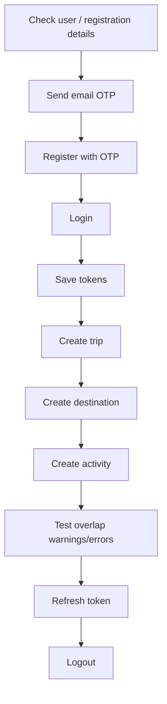

# Postman Guide

This document explains how to manually test the WanderMate / Travelling App backend using Postman.

---

## Base URLs

Local IntelliJ backend:

```text
http://localhost:8080/The-Project
```

Docker backend:

```text
http://localhost:8082/The-Project
```

Recommended Postman environment variable:

```text
baseUrl = http://localhost:8082/The-Project
```

---

## Recommended Environment Variables

Create a Postman environment with:

```text
baseUrl
username
email
phoneNumber
otp
accessToken
refreshToken
sessionToken
tripId
destinationId
activityId
profileImageUrl
profileImagePublicId
coverImageUrl
coverImagePublicId
```

---

## Protected API Headers

For protected APIs:

```text
Authorization: Bearer {{accessToken}}
Session-Token: {{sessionToken}}
```

For token refresh:

```text
Refresh-Token: {{refreshToken}}
Session-Token: {{sessionToken}}
```

---

## Recommended Manual Test Order



---

## 1. Verify Register Details

```http
POST {{baseUrl}}/api/v1/users/register/verify
```

Body:

```json
{
  "username": "JustinBo123",
  "password": "Password123",
  "email": "justin@example.com",
  "phoneNumber": "0412345678",
  "dob": "01/01/2000",
  "otp": ""
}
```

Expected:

```text
E000 / USER_DETAILS_VERIFIED
```

---

## 2. Send Email OTP

```http
POST {{baseUrl}}/api/v1/otp/send
```

Body:

```json
{
  "userName": "JustinBo123",
  "otpVerificationMethod": "EMAIL_OTP",
  "email": "justin@example.com",
  "emailEnum": "EMAIL_OTP_REGISTER"
}
```

Expected:

```text
E000 / OTP_SENT_SUCCESS
```

Note: real email sending requires working email/OAuth configuration. Public placeholder Docker config will not send real email.

---

## 3. Register

```http
POST {{baseUrl}}/api/v1/users/register
```

Body:

```json
{
  "username": "JustinBo123",
  "password": "Password123",
  "email": "justin@example.com",
  "phoneNumber": "0412345678",
  "dob": "01/01/2000",
  "otp": "123456"
}
```

Expected:

```text
E000 / USER_CREATED
```

---

## 4. Login

```http
POST {{baseUrl}}/api/v1/users/login
```

Body:

```json
{
  "username": "JustinBo123",
  "password": "Password123",
  "overrideMaxSession": false
}
```

Save response body values:

```text
accessToken
refreshToken
sessionToken
```

Postman test script example:

```javascript
const body = pm.response.json().body;
if (body) {
  pm.environment.set("accessToken", body.accessToken);
  pm.environment.set("refreshToken", body.refreshToken);
  pm.environment.set("sessionToken", body.sessionToken);
}
```

---

## 5. Create Trip

```http
POST {{baseUrl}}/api/v1/trips
```

Headers:

```text
Authorization: Bearer {{accessToken}}
Session-Token: {{sessionToken}}
```

Body:

```json
{
  "tripName": "Japan Trip",
  "destination": "Japan",
  "startDate": "2026-07-01T09:00:00",
  "endDate": "2026-07-10T18:00:00",
  "allowOverlap": false
}
```

Save `tripId` from response body.

---

## 6. Create Destination

```http
POST {{baseUrl}}/api/v1/trips/{{tripId}}/destinations
```

Body:

```json
{
  "destinationName": "Tokyo",
  "startDate": "2026-07-01T09:00:00",
  "endDate": "2026-07-05T18:00:00",
  "destinationOrder": 1,
  "notes": "First stop",
  "allowOverlap": false
}
```

Save `destinationId` from response body.

---

## 7. Create Activity

```http
POST {{baseUrl}}/api/v1/trips/{{tripId}}/destinations/{{destinationId}}/activities
```

Body:

```json
{
  "activityName": "Shibuya Crossing",
  "location": "Shibuya",
  "description": "Walk around and take photos",
  "startDateTime": "2026-07-01T10:00:00",
  "endDateTime": "2026-07-01T12:00:00"
}
```

Save `activityId
profileImageUrl
profileImagePublicId
coverImageUrl
coverImagePublicId` from response body.

---

## 8. Test Trip Overlap Warning

Create another trip with overlapping dates:

```json
{
  "tripName": "Japan Trip 2",
  "destination": "Japan",
  "startDate": "2026-07-03T09:00:00",
  "endDate": "2026-07-12T18:00:00",
  "allowOverlap": false
}
```

Expected:

```text
W001 / TRIP_OVERLAP_WARNING
```

Then retry with:

```json
{
  "tripName": "Japan Trip 2",
  "destination": "Japan",
  "startDate": "2026-07-03T09:00:00",
  "endDate": "2026-07-12T18:00:00",
  "allowOverlap": true
}
```

Expected: trip is created.

---

## 9. Test Destination Overlap Warning

Create another destination inside the same trip with overlapping dates.

Expected:

```text
W002 / DESTINATION_OVERLAP_WARNING
```

Then retry with:

```json
{
  "allowOverlap": true
}
```

inside the full request body.

---

## 10. Test Activity Overlap Hard Error

Create another activity overlapping an existing activity:

```json
{
  "activityName": "Lunch",
  "location": "Tokyo",
  "description": "Overlapping activity test",
  "startDateTime": "2026-07-01T11:00:00",
  "endDateTime": "2026-07-01T13:00:00"
}
```

Expected:

```text
E051 / ACTIVITY_TIME_CONFLICT_WITH_EXISTING_ACTIVITY
```

There is no `allowOverlap` override for activities.

---

## 11. Refresh Token

```http
POST {{baseUrl}}/api/v1/auth/refresh
```

Headers:

```text
Refresh-Token: {{refreshToken}}
Session-Token: {{sessionToken}}
```

Body:

```json
{}
```

Expected: new `accessToken` and `refreshToken`.

Update Postman variables after refresh.

---

## 12. Logout

```http
POST {{baseUrl}}/api/v1/users/logout
```

Headers:

```text
Authorization: Bearer {{accessToken}}
Session-Token: {{sessionToken}}
```

Expected:

```text
E000 / LOGOUT_SUCCESS
```

After logout, protected API calls using the same tokens should fail.

---

## SMS OTP Testing Note

You can test the phone OTP branch at service/unit-test level, but Postman should not be used as proof of real SMS delivery because no real SMS provider is currently integrated.

Current status:

```text
Email OTP: real when email config is valid
SMS OTP: mocked/stubbed service flow only
```

## V3 Collaboration Manual Test

Use two accounts.

```text
Account A = trip owner
Account B = invited/requesting user
```

Owner sends invitation:

```http
POST {{baseUrl}}/api/v1/trips/{{tripId}}/invitations
```

```json
{
  "username": "TravelFriend",
  "role": "EDITOR"
}
```

Invited user lists received invitations:

```http
GET {{baseUrl}}/api/v1/trips/invitations/received
```

Invited user accepts/rejects:

```http
PATCH {{baseUrl}}/api/v1/trips/invitations/{{requestId}}/accept
PATCH {{baseUrl}}/api/v1/trips/invitations/{{requestId}}/reject
```

Requester sends join request:

```http
POST {{baseUrl}}/api/v1/trips/{{tripId}}/join-requests
```

```json
{
  "role": "VIEWER"
}
```

Owner lists owned-trip join requests:

```http
GET {{baseUrl}}/api/v1/trips/join-requests/owned
```

Requester lists sent join requests:

```http
GET {{baseUrl}}/api/v1/trips/join-requests/sent
```

Owner accepts/rejects:

```http
PATCH {{baseUrl}}/api/v1/trips/join-requests/{{requestId}}/accept
PATCH {{baseUrl}}/api/v1/trips/join-requests/{{requestId}}/reject
```

Collaboration summary:

```http
GET {{baseUrl}}/api/v1/collaboration/summary
```

## V3 Share-Code Manual Test

Owner regenerates active share code:

```http
POST {{baseUrl}}/api/v1/trips/{{tripId}}/share-codes/regenerate
```

```json
{
  "defaultRole": "VIEWER"
}
```

Another user previews the code:

```http
GET {{baseUrl}}/api/v1/trips/share-codes/{{shareCode}}
```

Another user requests to join with the code:

```http
POST {{baseUrl}}/api/v1/trips/share-codes/{{shareCode}}/join-requests
```

```json
{
  "role": "VIEWER"
}
```

Owner gets active share code:

```http
GET {{baseUrl}}/api/v1/trips/{{tripId}}/share-codes/active
```

---

## Image Upload Manual Test

Upload profile image or trip cover:

```http
POST {{baseUrl}}/api/v1/uploads/images
```

Headers:

```text
Authorization: Bearer {{accessToken}}
Session-Token: {{sessionToken}}
```

Body type:

```text
form-data
```

Fields:

```text
file       = selected image file
imageType  = profile-images
```

or:

```text
file       = selected image file
imageType  = trip-covers
```

Expected response body:

```json
{
  "imageUrl": "https://res.cloudinary.com/demo/image/upload/v123/wandermate/profile-images/users/1/profile-1-abc.jpg",
  "publicId": "wandermate/profile-images/users/1/profile-1-abc",
  "fileName": "wandermate/profile-images/users/1/profile-1-abc",
  "imageType": "profile-images"
}
```

Save these values into Postman variables:

```text
profileImageUrl
profileImagePublicId
coverImageUrl
coverImagePublicId
```

---

## Update Profile Image with Cloudinary Values

After uploading a profile image, update the profile:

```http
PATCH {{baseUrl}}/api/v1/users/me/profile
```

```json
{
  "displayName": "Justin Bui",
  "phoneNumber": "0412345678",
  "dob": "01/01/2000",
  "profileImageUrl": "{{profileImageUrl}}",
  "profileImagePublicId": "{{profileImagePublicId}}"
}
```

To remove the profile image:

```json
{
  "profileImageUrl": "",
  "profileImagePublicId": ""
}
```

Expected behaviour:

```text
- New URL/publicId is saved.
- Old Cloudinary image is deleted if the publicId changed.
```

---

## Create or Update Trip Cover with Cloudinary Values

Create or update trip requests can include:

```json
{
  "tripName": "Japan Trip",
  "destination": "Japan",
  "startDate": "2026-07-01T09:00:00",
  "endDate": "2026-07-10T18:00:00",
  "allowOverlap": false,
  "coverImageUrl": "{{coverImageUrl}}",
  "coverImagePublicId": "{{coverImagePublicId}}"
}
```

To remove a trip cover on update:

```json
{
  "coverImageUrl": "",
  "coverImagePublicId": ""
}
```

Expected behaviour:

```text
- New cover URL/publicId is saved.
- Old Cloudinary cover is deleted if publicId changed.
- Deleting the trip deletes the stored cover image from Cloudinary.
```
