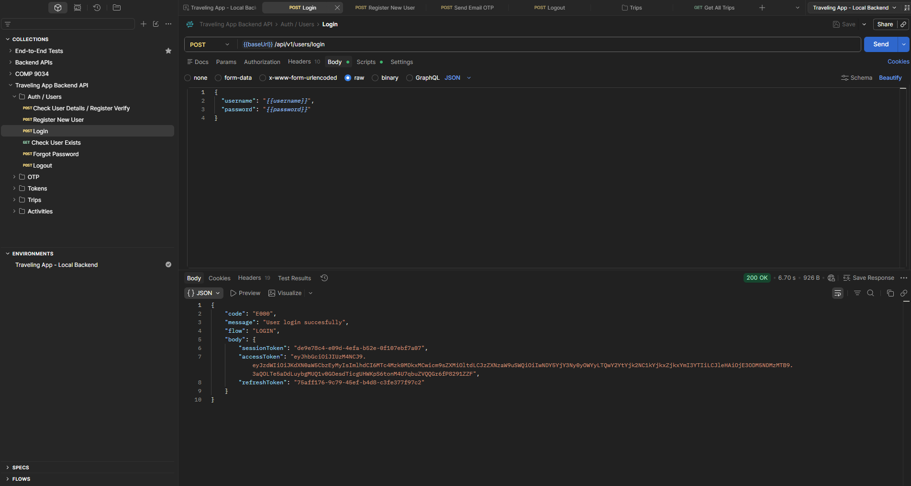

# Postman Guide

The Postman collection should cover auth, OTP, tokens, users, uploads, trips, destinations, nested activities, collaboration, members and share codes.

## Import order

1. Import the collection.
2. Import the environment you want to use: Local, Docker or Render.
3. Select the environment.
4. Run login and allow token variables to populate.
5. Run protected requests.

## Important variables

| Variable | Purpose |
|---|---|
| `baseUrl` | Backend base URL including `/Wandermate` |
| `username` | Test username |
| `password` | Test password |
| `email` | Test email |
| `phoneNumber` | Test phone |
| `otp` | OTP value for manual testing |
| `accessToken` | Bearer token after login |
| `refreshToken` | Refresh token after login |
| `sessionToken` | Session token after login |
| `tripId` | Created/selected trip |
| `destinationId` | Created/selected destination |
| `activityId` | Created/selected activity |
| `shareCode` | Generated share code |

## Correct nested activity path

Use:

```text
/api/v1/trips/{tripId}/destinations/{destinationId}/activities
```

Do not use the older direct trip activity path.

## Proof

