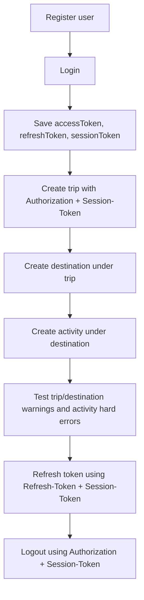

# Postman Guide

This document explains how to test the WanderMate / Travelling App backend using Postman.

---

## Base URLs

Local IntelliJ backend:

```text
http://localhost:8080/The-Project
```

Docker backend:

```text
http://localhost:8082/The-Project
```

If the application context path changes later, remove or update `/The-Project`.

---

## Recommended Environment Variables

Create a Postman environment with:

```text
baseUrl
accessToken
refreshToken
sessionToken
username
tripId
destinationId
activityId
otp
```

Example for Docker:

```text
baseUrl = http://localhost:8082/The-Project
```

Example for IntelliJ local run:

```text
baseUrl = http://localhost:8080/The-Project
```

---

## Typical Testing Order



---

## Testing Protected APIs

For protected APIs, add these headers:

```text
Authorization: Bearer {{accessToken}}
Session-Token: {{sessionToken}}
```

Login should save the returned tokens into the Postman environment if the collection has test scripts configured.

---

## Testing Refresh Token

The refresh endpoint does not require an access token, but it does require:

```text
Refresh-Token: {{refreshToken}}
Session-Token: {{sessionToken}}
```

Expected result:

```text
New accessToken and refreshToken are returned.
```

Update the Postman environment with the new values.

---

## Recommended Test Flow

### 1. Register

Create a new user.

### 2. Login

Login and save:

```text
accessToken
refreshToken
sessionToken
```

### 3. Create Trip

Create a trip using:

```text
Authorization: Bearer {{accessToken}}
Session-Token: {{sessionToken}}
```

Save the returned `tripId`.

### 4. Create Destination

Create a destination under the trip:

```text
POST {{baseUrl}}/api/v1/trips/{{tripId}}/destinations
```

Save the returned `destinationId`.

### 5. Create Activity

Create an activity under the destination:

```text
POST {{baseUrl}}/api/v1/trips/{{tripId}}/destinations/{{destinationId}}/activities
```

Save the returned `activityId`.

### 6. Test Trip Overlap Warning

Create another trip with overlapping dates.

Expected result:

```text
TRIP_OVERLAP_WARNING
```

Then retry the same request with:

```json
{
  "allowOverlap": true
}
```

Expected result:

```text
Trip is created.
```

### 7. Test Destination Overlap Warning

Create another destination inside the same trip with overlapping dates.

Expected result:

```text
DESTINATION_OVERLAP_WARNING
```

Then retry the same request with:

```json
{
  "allowOverlap": true
}
```

Expected result:

```text
Destination is created.
```

### 8. Test Activity Overlap Hard Error

Create another activity that overlaps an existing activity.

Expected result:

```text
ACTIVITY_OVERLAP_ERROR
```

There is no `allowOverlap` flow for activities.

### 9. Test Activity Outside Destination Range

Create an activity before the destination starts or after the destination ends.

Expected result:

```text
ACTIVITY_OUTSIDE_DESTINATION_RANGE
```

### 10. Refresh Token

Use the refresh token and session token to request a new access token.

### 11. Logout

Logout and verify the session/refresh token is revoked.

---

## Sample Request Bodies

### Create Trip

```json
{
  "tripName": "Japan Trip",
  "destination": "Japan",
  "startDate": "2026-07-01T09:00:00",
  "endDate": "2026-07-10T18:00:00",
  "allowOverlap": false
}
```

### Create Destination

```json
{
  "destinationName": "Tokyo",
  "startDate": "2026-07-01T09:00:00",
  "endDate": "2026-07-05T18:00:00",
  "destinationOrder": 1,
  "notes": "First stop",
  "allowOverlap": false
}
```

### Create Activity

```json
{
  "activityName": "Visit Tokyo Tower",
  "location": "Tokyo Tower",
  "description": "Evening visit",
  "startDateTime": "2026-07-02T10:00:00",
  "endDateTime": "2026-07-02T12:00:00"
}
```

---

## Expected Validation Results

### Trip

```text
Duplicate trip name
→ TRIP_NAME_ALREADY_EXISTS

Overlapping trip
→ TRIP_OVERLAP_WARNING

Retry overlapping trip with allowOverlap true
→ success

Update trip so existing destination is outside new trip range
→ TRIP_DATE_CONFLICT_WITH_DESTINATION
```

### Destination

```text
Destination outside trip range
→ DESTINATION_DATE_OUTSIDE_TRIP_RANGE

Overlapping destination
→ DESTINATION_OVERLAP_WARNING

Retry overlapping destination with allowOverlap true
→ success
```

### Activity

```text
Activity outside destination range
→ ACTIVITY_OUTSIDE_DESTINATION_RANGE

Overlapping activity
→ ACTIVITY_OVERLAP_ERROR

Activity starts exactly when another ends
→ success
```

---

## Docker Demo Note

If email OAuth is disabled in `.env`, email OTP may not actually send.

For public/demo Docker:

```env
EMAIL_OAUTH_REFRESH_ENABLED=false
```

For private testing, use real email OAuth values in `.env`.

---

## What to Screenshot for Portfolio

Good screenshots to include later:

```text
Swagger page
Successful login response
Protected API request with Bearer token and Session-Token
Trip creation response
Destination creation response
Activity creation response
Trip overlap warning
Destination overlap warning
Activity overlap validation error
Docker containers running
```

Hide access tokens and secrets in screenshots.
