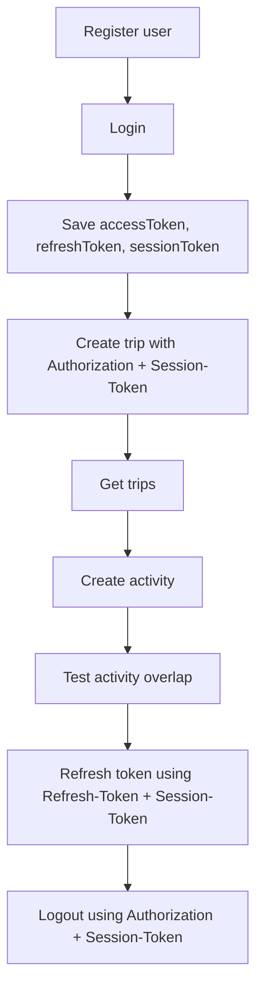

# Postman Guide

This document explains how to test the Travelling App backend using Postman.

---

## Base URLs

Local IntelliJ backend:

```text
http://localhost:8080/The-Project
```

Docker backend:

```text
http://localhost:8081/The-Project
```

---

## Recommended Environment Variables

Create a Postman environment with:

```text
baseUrl
accessToken
refreshToken
sessionToken
username
tripId
activityId
otp
```

Example:

```text
baseUrl = http://localhost:8081/The-Project
```

---

## Typical Testing Order



---

## Testing Protected APIs

For protected APIs, add these headers:

```text
Authorization: Bearer {{accessToken}}
Session-Token: {{sessionToken}}
```

Login should save the returned tokens into the Postman environment if the collection has test scripts configured.

---

## Testing Refresh Token

The refresh endpoint does not require an access token, but it does require:

```text
Refresh-Token: {{refreshToken}}
Session-Token: {{sessionToken}}
```

Expected result:

```text
New accessToken and refreshToken are returned.
```

Update the Postman environment with the new values.

---

## Recommended Test Flow

### 1. Register

Create a new user.

### 2. Login

Login and save:

```text
accessToken
refreshToken
sessionToken
```

### 3. Create Trip

Create a trip using:

```text
Authorization: Bearer {{accessToken}}
Session-Token: {{sessionToken}}
```

### 4. Create Activity

Create an activity under the trip.

### 5. Test Overlap Validation

Create another activity with overlapping time.

Expected result:

```text
Request should fail due to overlap validation.
```

### 6. Refresh Token

Use the refresh token and session token to request a new access token.

### 7. Logout

Logout and verify the session/refresh token is revoked.

---

## Docker Demo Note

If email OAuth is disabled in `.env`, email OTP may not actually send.

For public/demo Docker:

```env
EMAIL_OAUTH_REFRESH_ENABLED=false
```

For private testing, use real email OAuth values in `.env`.

---

## What to Screenshot for Portfolio

Good screenshots to include later:

```text
Swagger page
Successful login response
Protected API request with Bearer token and Session-Token
Trip creation response
Activity overlap validation error
Docker containers running
```

Hide access tokens and secrets in screenshots.
