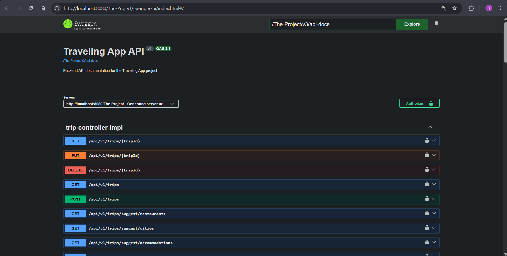

# Production API Docs

Production deployment uses the same context path:

```text
/The-Project
```

Render base URL:

```text
https://wandermate-fullstack.onrender.com/The-Project
```

## Health check

[Open the production health endpoint](https://wandermate-fullstack.onrender.com/The-Project/api/v1/health).
The free Render service may take about a minute to wake after inactivity.

## Render logs proof


## Swagger/OpenAPI

Swagger/OpenAPI is useful locally for development and endpoint inspection.

Local Swagger proof:



In production profile, Swagger may be disabled for security/simplicity depending on configuration.

## Production testing checklist

1. Health endpoint returns success.
2. Register/login works against production DB/config.
3. OTP email works.
4. Access token works on protected endpoint.
5. Refresh token works.
6. Logout revokes session.
7. Cloudinary image upload works.
8. Trip/destination/activity CRUD works.
9. Collaboration roles work.
10. No secrets are exposed in logs or docs.

## Environment warning

Production secrets must live in Render environment variables, not in committed files.
