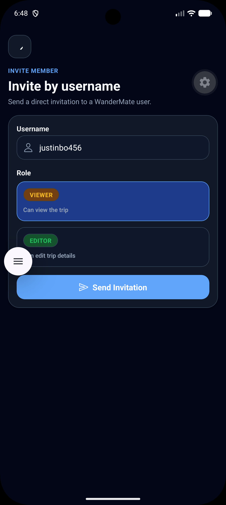
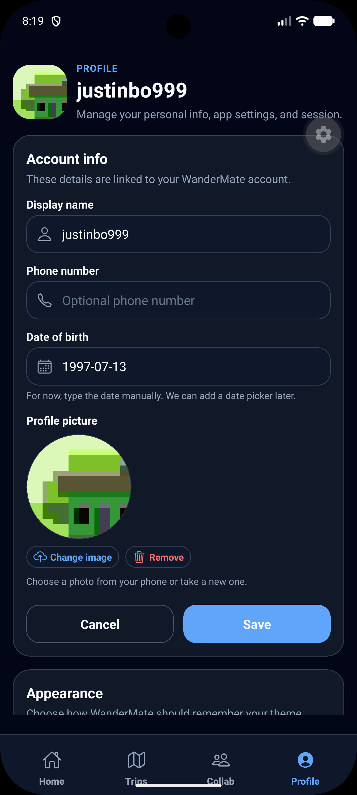

# WanderMate Frontend

React Native Expo frontend for the WanderMate trip planning and collaboration app.

The frontend provides authentication screens, trip planning UI, destination/activity screens, collaboration screens, image upload, profile/settings, theme support and persistent bottom navigation.

## Status

| Area | Status |
|---|---|
| Auth screens | Login, register/OTP, forgot password |
| Token integration | access token, refresh token, session token storage/refresh/logout |
| Trips | List, create, detail, edit, cover upload |
| Destinations | List, create, detail, edit, delete |
| Activities | Nested under destinations |
| Collaboration | Invite, share code, requests, members, roles |
| Profile | Avatar upload, profile info, theme settings |
| Theme | Light/dark/system theme support |
| Navigation | Expo Router plus persistent bottom tabs |
| TypeScript | `npm run typecheck` proof included |
| Tests | Vitest API tests, React Native component tests, Maestro smoke flow |

## Stack

- Expo Router
- React Native
- TypeScript
- Axios
- Expo SecureStore
- Expo Image Picker
- Expo Clipboard
- Expo Vector Icons
- React Hook Form
- Zod-style validation flow
- Zustand-style stores

## Run

```bash
cd frontend
npm install
npm run start
```

For Android:

```bash
npm run android
```

For iOS:

```bash
npm run ios
```

For web:

```bash
npm run web
```

If a real phone cannot load Expo assets over LAN, use tunnel mode:

```bash
npx expo start --tunnel -c
```

## Environment

Frontend API base URL is configured under:

```text
src/constants/env.ts
```

Make sure it points to the backend base URL including `/Wandermate`.

## Main folders

| Folder | Purpose |
|---|---|
| `app/` | Expo Router screens and routes |
| `src/api/` | API clients |
| `src/components/` | reusable UI/collaboration/media components |
| `src/stores/` | auth/theme/token stores |
| `src/types/` | TypeScript API/domain types |
| `src/utils/` | formatting, token, role and helper utilities |
| `src/theme/` | app theme configuration |
| `src/constants/` | env and app constants |

## Key screens

| Screen | Purpose |
|---|---|
| `(auth)/login.tsx` | Login |
| `(auth)/register.tsx` | Register and OTP cooldown UI |
| `(auth)/forgot-password.tsx` | Forgot-password OTP flow |
| `(tabs)/trips.tsx` | My Trips list |
| `trips/[tripId]/index.tsx` | Trip detail |
| `trips/[tripId]/destinations/create.tsx` | Create destination |
| `trips/[tripId]/destinations/[destinationId]/index.tsx` | Destination detail |
| `trips/[tripId]/destinations/[destinationId]/activities/[activityId]/index.tsx` | Activity detail |
| `trips/[tripId]/collaboration/*` | Collaboration menu, invite, share code, requests, members |
| `(tabs)/profile.tsx` | Profile/avatar/theme settings |

## Screenshots

### My Trips


### Trip detail as owner


### Invite member



### Profile settings


### Theme support

The app supports light, dark and system themes. See the
[dark-theme My Trips screen](../docs/screenshots/03-my-trips.png) and
[theme settings](../docs/screenshots/15-profile-avatar-settings.png).

## Typecheck

```bash
npm run typecheck
```

## Automated tests

```bash
npm test
```

The API-client integration tests cover authentication behavior for `401`,
permission-only `403`, and explicit invalid-session responses. An ordinary
authorization failure must not sign the user out.

`npm test` runs both the Vitest API-client suite and Jest/React Native Testing
Library component suite. The `.maestro/login-smoke.yml` flow provides an
installable-app smoke test through the `e2e-test` EAS build profile.

The current local suite contains 10 tests covering session expiry,
permission-only `403` responses, shared authentication controls, and the
central local-session lifecycle.

Run the local Maestro flow after installing an E2E APK/app on an emulator:

```bash
maestro test .maestro/login-smoke.yml
```

Proof:


## Permission-aware UI

The frontend hides or disables actions based on the current user's trip role.

| Role | UI behaviour |
|---|---|
| OWNER | Can manage trip, members, roles, requests and content |
| EDITOR | Can edit trip content where allowed |
| VIEWER | Read-only view, no destructive/edit actions |

Proof:


## Image upload

Image upload is handled through shared media components and backend upload API.

Proof:


